# Lab 01: Getting Started with Azure IoT Services

# Introduction to IoT and Azure IoT Services

## Lab Scenario

You are an Azure IoT Developer working for Contoso, a company that crafts and distributes gourmet cheeses.

You have been tasked with exploring Azure and the Azure IoT services that you will using to develop Contoso's IoT solution. You have already become familiar with the Azure portal and created a resource group for your project. Now you need to begin investigating the Azure IoT services.

## Lab Objectives

In this lab, you will create and examine an Azure IoT Hub and an IoT Hub Device Provisioning Service. The lab includes the following exercises:

* Create an IoT Hub using the Azure portal
* Examine features of the IoT Hub service
* Create a Device Provisioning Service and link it to your IoT Hub
* Examine features of the Device Provisioning Service

## Lab Instructions

### Exercise 1: Create an IoT Hub using the Azure portal

The Azure IoT Hub is a fully managed service that enables reliable and secure bidirectional communications between IoT devices and Azure. The Azure IoT Hub service provides the following:

* Establish bidirectional communication with billions of IoT devices
* Multiple device-to-cloud and cloud-to-device communication options, including one-way messaging, file transfer, and request-reply methods.
* Built-in declarative message routing to other Azure services.
* A queryable store for device metadata and synchronized state information.
* Secure communications and access control using per-device security keys or X.509 certificates.
* Extensive monitoring for device connectivity and device identity management events.
* SDK device libraries for the most popular languages and platforms.

In this exercise, you will use the Azure portal to create and configure your IoT Hub.

#### Task 1: Use the Azure portal to create a IoT Hub with required property settings

1. On the Azure portal, in the **Search resources, services, and Docs (G+/)** bar search **IoT Hub** and click on it.

    

1. To begin the process of creating your new IoT Hub, click **Create**.

    
    
1. On the **IoT hub** blades **Basics** tab, provide the following details and then click on **Next:Networking>**.

   - Subscription: **Select the default Subscription (1)**.
   - Resource group: **Select the Existing Resource group (2)**.
   - IoT hub name: Enter **iot-az220-training-cah<inject key="DeploymentID" enableCopy="false"/>(3)**
   - Region : **eastus(4)**
   - Tier :**Standard(5)** 

    

1. Ensure the **Minimum TLS Version** is set to **1.0** and then click on **Next:Management>**.

    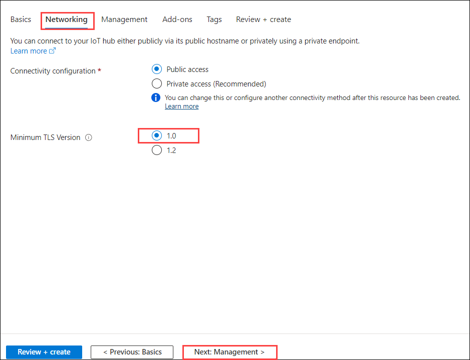

1. Under **Scale** (you may need to scroll down), ensure that **Device-to-cloud partitions** is set to **4** and click on **Review + create**.

    

1. Click on **Create**.

    Deployment can take a minute or more to complete. 

1. Once the Deployment is completed,Click on **Go to resource** and then you will be able to see the newly created IoT Hub.

    

<validation step="44532bdc-58b8-4478-82e2-9031fec98358" />

>**Congratulations** on completing the Task! Now, it's time to validate it. Here are the steps:

  > - Hit the Validate button for the corresponding task. If you receive a success message, you have successfully validated the lab. 
  > - If not, carefully read the error message and retry the step, following the instructions in the lab guide.
  > - If you need any assistance, please contact us at labs-support@spektrasystems.com.

### Exercise 2: Examine the IoT Hub Service

IoT Hub is a managed service, hosted in the cloud, that acts as a central message hub for bi-directional communication between your Azure IoT services and your connected devices.

In this exercise, you will examine some of the features that IoT Hub provides.

#### Task 1: Explore the IoT Hub Overview information

1. Open your Azure dashboard.

1. Search and select **IoT Hub** from the Azure dashboard.

    

1. Click on the newly created **iot-az220-training-cah<inject key="DeploymentID" enableCopy="false"/>**

    

1. At the bottom of your IoT Hub blade **Overview** page, notice the **IoT Hub Usage** tile.

1. To the right of the **IoT Hub Usage(1)** tile, notice the **Number of messages used(2)** tile and the **Device to cloud messages(3)** tile.

    

    The **Device to cloud messages** tile provides a quick view of the incoming messages from your devices over time.

    The **Number of messages used** tile can help you to keep track of the total number of messages used.

#### Task 2: View features of IoT Hub using the left-side menu

1. On the IoT Hub blade,from the left navigation menu,under **Device management**, click **Devices**

    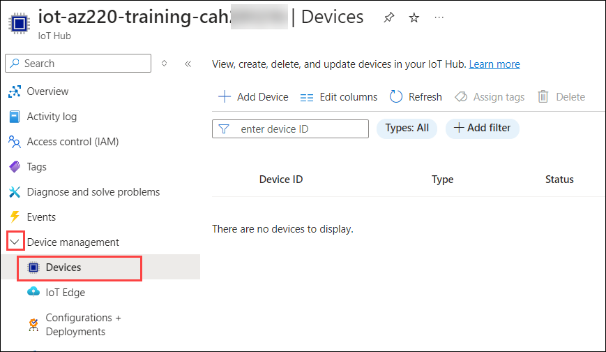

    This pane can be used to add, modify, and delete devices registered to your hub.

1. On the left-side menu, near the top, click **Activity log**

    As the name implies, this pane gives you access to a log that can be used to review activities and diagnose issues. 

    

1. On the left-side menu, under **Hub settings**, click **Built-in endpoints**

    IoT Hub exposes "endpoints" that enable external connections. Essentially, an endpoint is anything connected to or communicating with your IoT Hub. You should see that your hub already has endpoints defined, including the following:

    * _Event Hub compatible endpoint_ **(1)**
    * _Cloud to device messaging_ **(2)**

    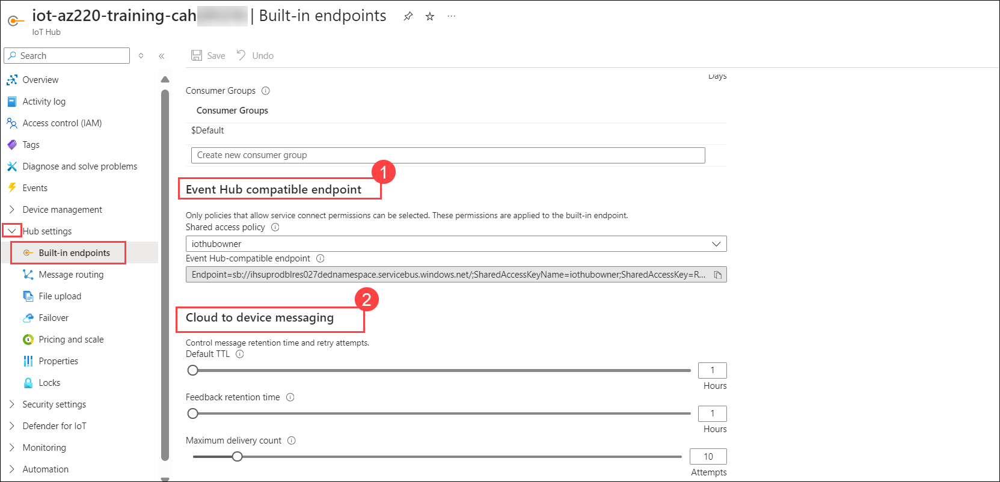

1. On the left-side menu, under **Hub settings**, click **Message routing**

    The IoT Hub message routing feature enables you to route incoming device-to-cloud messages to service endpoints such as Azure Storage containers, Event Hubs, and Service Bus queues. You can also create routing rules to perform query-based routes.

1. At the top of the **Message routing** pane, click **Custom endpoints**.

    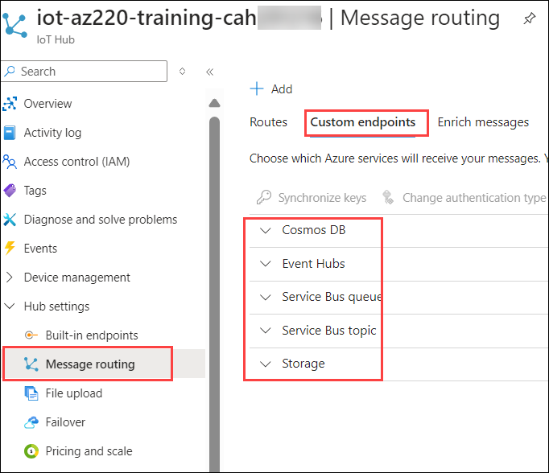

    Custom endpoints (such as Event Hubs and Storage) are often used within an IoT implementation.

    > **Note**:  This lab exercise is only intended to be an introduction to the IoT Hub service and get you more comfortable with the UI, so don't worry if you feel a bit overwhelmed at this point.

### Exercise 3: Create a Device Provisioning Service using the Azure portal

The Azure IoT Hub Device Provisioning Service is a helper service for IoT Hub that enables zero-touch, just-in-time provisioning to the right IoT hub without requiring human intervention. The Device Provisioning Service provides the following:

* Zero-touch provisioning to a single IoT solution without hardcoding IoT Hub connection information at the factory (initial setup)
* Load balancing devices across multiple hubs
* Connecting devices to their owner's IoT solution based on sales transaction data (multitenancy)
* Connecting devices to a particular IoT solution depending on use-case (solution isolation)

#### Task 1: Use the Azure portal to a Device Provisioning Service with required property settings

1. On the Azure portal menu, click **+ Create a resource**.

    

1. In the Search textbox, type **device provisioning service(1)** and then press Enter.

1. On the **Marketplace** blade, click **IoT Hub Device Provisioning Service(2)** search result.

    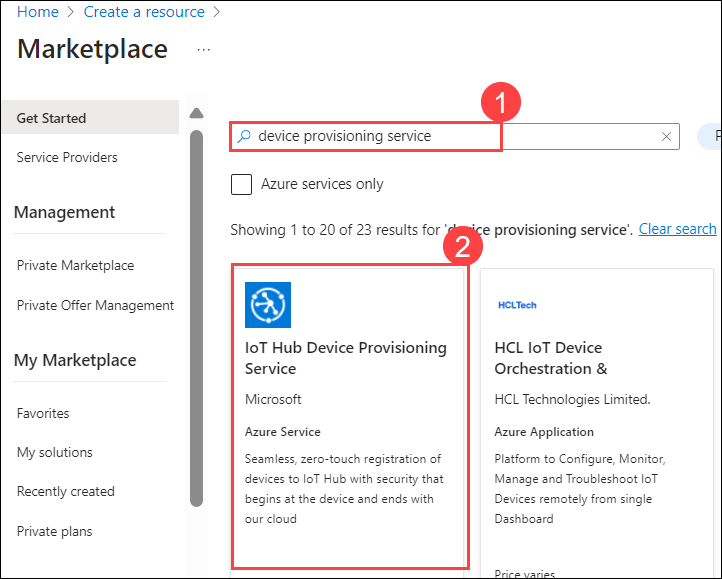

1. To begin the process of creating your new DPS instance, click **Create**.

    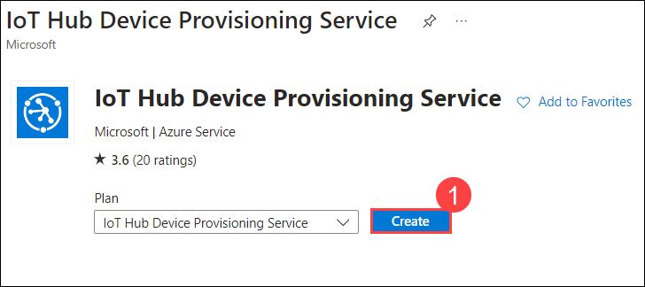

1. On the **Azure IoT Hub Device Provisioning Service** blades **Basics** tab, provide the following details and then click on **Review + create**.

   - Subscription: **Select the default subscription (1)**
   - Resource Group: **Select the existing Resource group(2)**
   - Name: **dps-az220-training-cah<inject key="DeploymentID" enableCopy="false"/>(3)**
   - Region: **eastus(4)**

    

1. Click on **Create**.
1. After the deployement is completed, click on **Go to resource** to see the newly created **DPS**.

<validation step="8cec2de1-1475-4740-8c14-a8712f80cfd5" />

>**Congratulations** on completing the Task! Now, it's time to validate it. Here are the steps:
  > - Hit the Validate button for the corresponding task. If you receive a success message, you have successfully validated the lab. 
  > - If not, carefully read the error message and retry the step, following the instructions in the lab guide.
  > - If you need any assistance, please contact us at labs-support@spektrasystems.com.

#### Task 2: Link your IoT Hub and Device Provisioning Service.

1. On the Azure dashboard you can see the list of both your **IoT Hub(2)** and **DPS resources(1)**.

    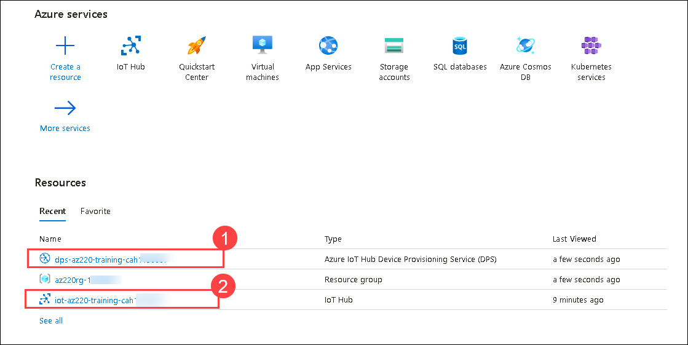

1. Click on **dps-az220-training-cah281216**.

    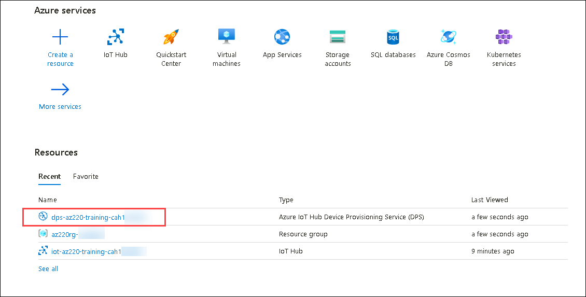

1. On the **Device Provisioning Service** blade, under **Settings**, click on **Linked IoT hubs(1)**.

1. At the top of the blade, click **+ Add(2)**.

1. On the **Add link to IoT hub** blade, ensure that the **Subscription(3)** dropdown is displaying the subscription that you are using for this lab.

1. Open the IoT hub dropdown, and then select the **iot-az220-training-cah<inject key="DeploymentID" enableCopy="false"/>(4)**.

    This is the IoT Hub that you created in the previous exercise.

1. In the Access Policy dropdown, select **iothubowner(5)**.

1. Click on **Save(6)**.

    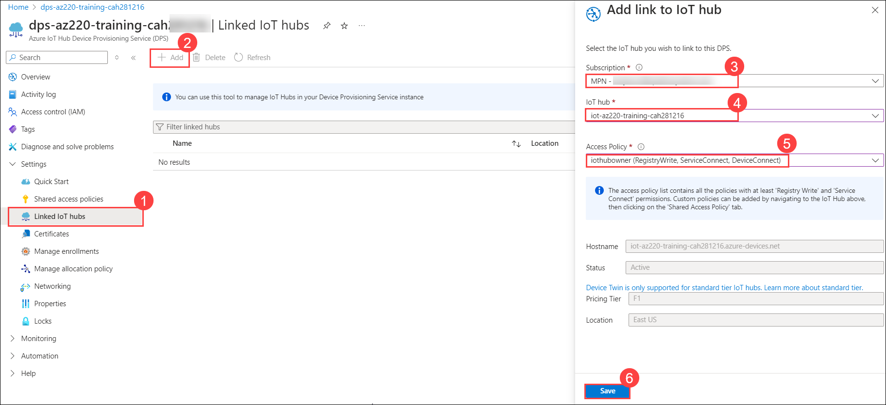

1. Here you can see the newly created Linked IoT Hub.

    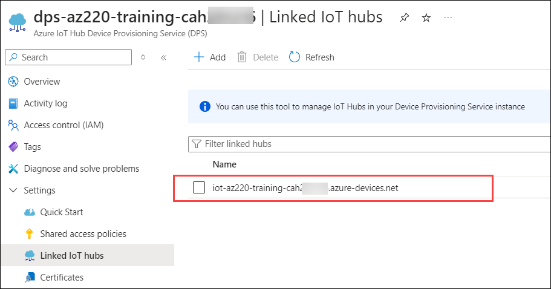

### Exercise 4: Examine the Device Provisioning Service

The IoT Hub Device Provisioning Service is a helper service for IoT Hub that enables zero-touch, just-in-time provisioning to the right IoT hub without requiring human intervention, enabling customers to provision millions of devices in a secure and scalable manner.

#### Task 1: Explore the Device Provisioning Service Overview information

1. On your Azure dashboard, search and select the **Resource group**.

    
   
1. Select the Resource group **az220rg-<inject key="DeploymentID" enableCopy="false"></inject>**.

       

1. Click on **dps-az220-training-cah281216**

    

    * [Azure IoT Hub Device Provisioning Service Documentation](https://docs.microsoft.com/en-us/azure/iot-dps/)
    * [Learn more about IoT Hub Device Provisioning Service](https://docs.microsoft.com/en-us/azure/iot-dps/about-iot-dps)
    * [Device Provisioning concepts](https://docs.microsoft.com/en-us/azure/iot-dps/concepts-service)
    * [Pricing and scale details](https://azure.microsoft.com/en-us/pricing/details/iot-hub/)

    When time permits, you can come back and explore these links.

#### Task 2: View features of Device Provisioning Service using the navigation menu

1. On the left-side menu, near the top, click **Activity log**

    As the name implies, this pane gives you access to a log that can be used to review activities and diagnose issues. You can also define queries that help with routine tasks. Very handy.

    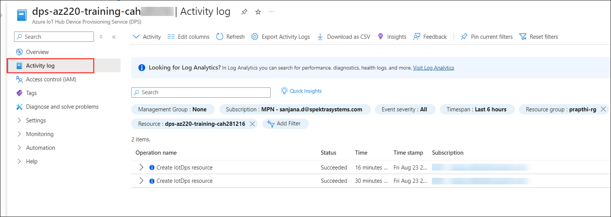

1. On the left-side menu, under **Settings**, click **Quick Start**.

    This pane lists the steps to start using the Iot Hub Device Provisioning Service, links to documentation and shortcuts to other blades for configuring DPS.

    

1. On the left-side menu, under **Settings**, click **Shared access policies**.

    This pane provides management of access policies, lists the existing policies and the associated permissions.

    

1. On the left-side menu, under **Settings**, click **Linked IoT hubs**.

    Here you can see the linked IoT Hub from earlier. The Device Provisioning Service can only provision devices to IoT hubs that have been linked to it. Linking an IoT hub to an instance of the Device Provisioning service gives the service read/write permissions to the IoT hub's device registry; with the link, a Device Provisioning service can register a device ID and set the initial configuration in the device twin. 

    

1. On the left-side menu, under **Settings**, click **Certificates(1)**.

    

    Here you can manage the X.509 certificates that can be used to secure your Azure IoT hub using the X.509 Certificate Authentication.

1. On the left-side menu, under **Settings**, click **Manage enrollments(2)**.

    Here you can manage the enrollment groups and individual enrollments.

    Enrollment groups can be used for a large number of devices that share a desired initial configuration, or for devices all going to the same tenant. An enrollment group is a group of devices that share a specific attestation mechanism. Enrollment groups support both X.509 as well as symmetric. 

    An individual enrollment is an entry for a single device that may register. 

    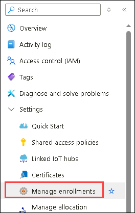

1. Take a minute to review some of the other menu options under **Settings**

   > **Note**:  This lab exercise is only intended to be an introduction to the IoT Hub Device Provisioning Service and get you more comfortable with the UI, so don't worry if you feel a bit overwhelmed at this point.

## Summary

In this lab, you have created a Azure IoT Hub and explored its features, then created and linked a Device Provisioning Service to the IoT Hub and also explored the features of the Device Provisioning Service.

### You have successfully completed the lab
