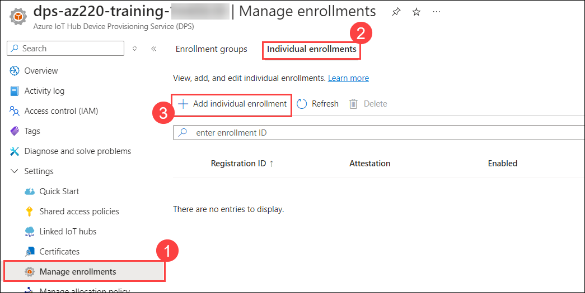
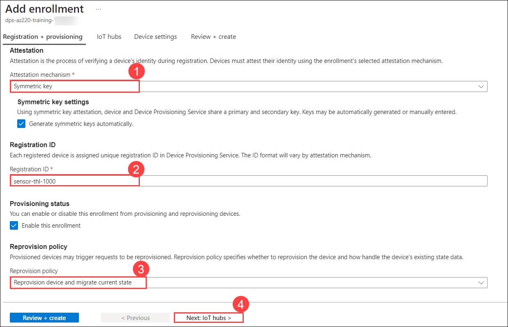
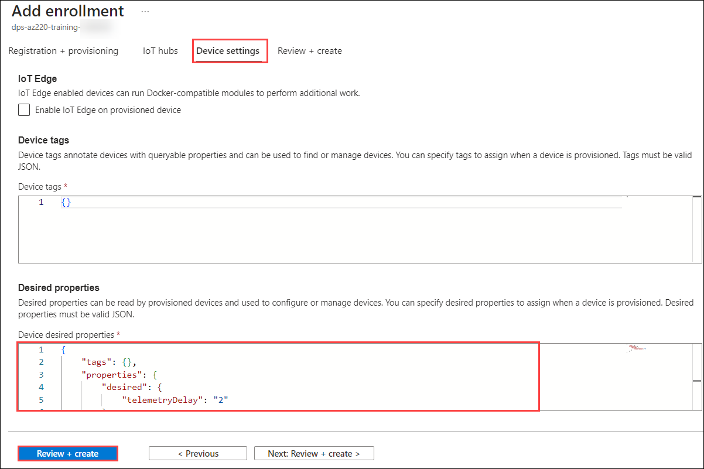
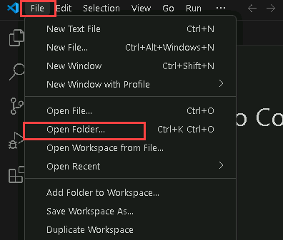
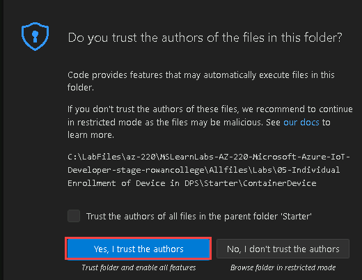
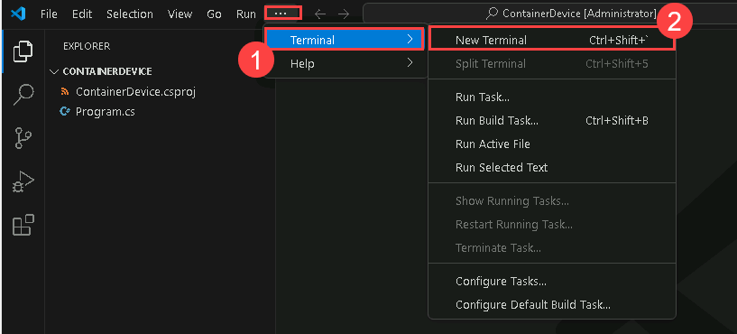
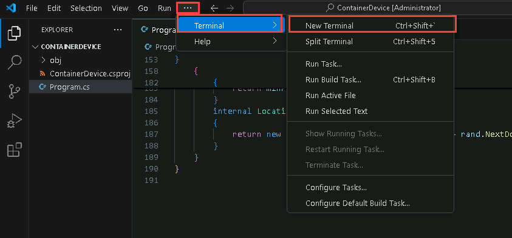
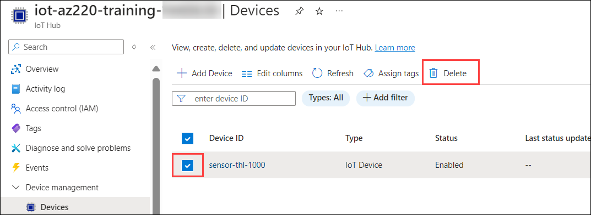

# Lab 03: Individual Enrollment of a Device in DPS

## Overview

In this lab, you will begin by reviewing the lab prerequisites and you will run a script if needed to ensure that your Azure subscription includes the required resources. You will then create a new individual enrollment in DPS that uses Symmetric Key attestation and specifies an initial Device Twin State (telemetry rate) for the device. With the device enrollment saved, you will go back into the enrollment and get the auto-generated Primary and Secondary keys needed for device attestation. Next, you create a simulated device and verify that device connects successfully with IoT hub and that the initial device twin properties are applied by the device as expected. To finish up, you will complete a deprovisioning process that securely removes the device from your solution by both disenrolling and deregistering the device (from DPS and IoT hub respectively).

## Lab Scenario

Contoso management is pushing for an update to their existing Asset Monitoring and Tracking Solution. The update will use IoT devices to reduce the manual data entry work that is required under the current system and provide more advanced monitoring during the shipping process. The solution relies on the ability to provision IoT devices when shipping containers are loaded and deprovision the devices when the container arrives at the destination. The best option for managing the provisioning requirements appears to be the IoT Hub Device Provisioning Service (DPS).

The proposed system will use IoT devices with integrated sensors for tracking the location, temperature, and pressure of shipping containers during transit. The IoT devices will be placed within the existing shipping containers that Contoso uses to transport their cheese, and will connect to Azure IoT Hub using vehicle-provided WiFi. The new system will provide continuous monitoring of the product environment and enable a variety of notification scenarios when issues are detected. The rate at which telemetry is sent to IoT hub must be configurable.

In Contoso's cheese packaging facility, when an empty container enters the system it will be equipped with the new IoT device and then loaded with packaged cheese products. The IoT device will be auto-provisioned to IoT hub using DPS. When the container arrives at the destination, the IoT device will be retrieved and must be fully deprovisioned (disenrolled and deregistered). The recovered devices will be recycled and re-used for future shipments following the same auto-provisioning process.

## Lab Objectives

In this lab, you will perform:
 - Exercise 1: Create new individual enrollment (Symmetric keys) in DPS
 - Exercise 2: Configure Simulated Device
 - Exercise 3: Test the Simulated Device
 - Exercise 4: Deprovision the Device

## Architecture Diagram


### Exercise 1: Create new individual enrollment (Symmetric keys) in DPS

In this exercise, you will create a new individual enrollment for a device within the Device Provisioning Service (DPS) using _symmetric key attestation_. You will also configure the initial device state within the enrollment. After saving your enrollment, you will go back in and obtain the auto-generated attestation Keys that get created when the enrollment is saved.

### Task 1: Create the enrollment

In this task, you wil create an individual enrollment in the Device Provisioning Service.

1. In the Azure portal navigate to the resource group **az220rg-<inject key="DeploymentID" enableCopy="false" />**. and select the **dps-az220-training-<inject key="DeploymentID" enableCopy="false" />** from the resource list.

   

1. On the left-side menu under **Settings**, click on **Manage enrollments(1)** then navigate to **Individual enrollments(2)** and click on **+ Add individual enrollment(3)**.

   

1. On the **Add Enrollment** blade under **Registration + provisioning**, fill the details as follows: 

    - **Attestation** : choose **Symmetric Key** **(1)** from dropdown.
    - **Registration ID** : **sensor-thl-1000** **(2)**. 
    - **Reprovision policy** : select **Reprovision device and migrate current state** **(3)**.
    - Click on **Next: IoT hubs** **(4)**.

      
   

1. On the **Add Enrollment** blade under **IoT hubs**, fill the details as follows:

    - **Target IoT hubs** : select your **IoT hub** **(1)** from dropdown.
    - **Allocation policy** : select **Evenly weighted distribution** **(2)**.
    - Click on **Next: Device settings >** **(3)**.

      
   

1. Under **Device settings** in the **Desired properties** field delete the existing content and add the below json data.

    The final JSON will be like the following:

    ```json
    {
        "tags": {},
        "properties": {
            "desired": {
                "telemetryDelay": "2"
            }
        }
    }
    ```
    

    This field contains JSON data that represents the initial configuration of desired properties for the device. The data that you entered will be used by the Device to set the time delay for reading sensor telemetry and sending events to IoT Hub.

1. Click on **Review + create** and select **create** after validation is successfull.

### Task 2: Review Enrollment and Obtain Authentication Keys

In this task, you will be reviewing the enrollment created and obtain the keys for further tasks.

1. On the **Manage enrollments(1)** pane, to view the list of individual device enrollments, click on **individual enrollments(2)**.

    

    As you may recall, you will be using the enrollment record to obtain the Authentication keys.

1. Under **Registration ID**, click on **sensor-thl-1000**.

    This blade enables you to view the enrollment details for the individual enrollment that you just created.

1. Copy the **Primary Key** and **Secondary Key** values for this device enrollment, and then save them to a file for later reference.

   

## Exercise 2: Configure Simulated Device

In this exercise, you will configure a Simulated Device written in C# to connect to Azure IoT using the individual enrollment created in the previous exercise. You will also add code to the Simulated Device that will read and update device configuration based on the device twin within Azure IoT Hub.

The simulated device that you create in this exercise represents an IoT device that will be located within a shipping container/box, and will be used to monitor Contoso products while they are in transit. The sensor telemetry from the device that will be sent to Azure IoT Hub includes Temperature, Humidity, Pressure, and Latitude/Longitude coordinates of the container. The device is part of the overall asset tracking solution.

> **Note**: You may have the impression that creating this simulated device is a bit redundant with what you created in the previous lab, but the attestation mechanism that you implement in this lab is quite different from what you did previously. In the previous lab, you used a shared access key to authenticate, which does not require device provisioning, but also does not give the provisioning management benefits (such as leveraging device twins), and it requires fairly large distribution and management of a shared key. In this lab, you are provisioning a unique device through the Device Provisioning Service.

### Task 1: Create the Simulated Device

In this task, you will be creating the simulating device using the dotnet project.

1. On the left-side menu of the **dps-az220-training-<inject key="DeploymentID" enableCopy="false" />** blade, click on **Overview**.

1. In the top-right area of the blade, hover the mouse pointer over value assigned to **ID Scope**, and then click on **Copy to clipboard**.

   

1. Open **Visual Studio Code**.

   

1. On the **File** menu, click **Open Folder**.

   
   
1. Navigate to `C:\LabFiles\az-220\MSLearnLabs-AZ-220-Microsoft-Azure-IoT-Developer-stage-rowancollege\Allfiles\Labs\05-Individual Enrollment of Device in DPS\Starter\ContainerDevice`. and click on **select folder**.

   

1. If the pop up appears clieck on **Yes, I trust the authors**.

   

1. Open integrated Terminal in **Visual studio code** click on **Terminal(1)** and then **New Terminal(2)**. At the Terminal command prompt, to restore all the application NuGet packages, enter the following command:

   

    ```cmd/sh
    dotnet restore
    ```

1. In the Visual Studio Code **explorer** pane, click **Program.cs**.

1. In the code editor, near the top of the Program class, locate the **dpsIdScope** variable.

1. Update the value assigned to **dpsIdScope** using the ID Scope that you copied from the Device Provisioning Service.

    > **Note**: If you don't have the value of ID Scope available to you, you can find it on the Overview blade of the DPS service (in the Azure portal).

1. Locate the **registrationId** variable, and update the assigned value using **sensor-thl-1000**

    This variable represents the **Registration ID** value for the individual enrollment that you created in the Device Provisioning Service.

1. Update the **individualEnrollmentPrimaryKey** and **individualEnrollmentSecondaryKey** variables using the **Primary Key** and **Secondary Key** values that you copied in Exercise 1 Task2.

    > **Note**: If you don't have these Key values available, you can copy them from the Azure portal as follows -
    >
    > Open the **Manage enrollments** blade, click **Individual Enrollments**, click **sensor-thl-1000**. Copy the **Primary key and secondary key** values and then paste as noted above.

        

### Task 2: Add the provisioning code

In this task, you will be adding the code to the dotnet project for provisioning and also implement the code that provisions the device via DPS and creates a DeviceClient instance that can be used to connect to the IoT Hub.

1. Take a minute to scan through the code in the **Program.cs** file.

   The overall layout of the **ContainerDevice** application is similar to the **CaveDevice** application that you created in Lab 4. Notice that both applications include the following:

    * Using statements
    * Namespace definition
      * Program class - responsible for connecting to Azure IoT and sending telemetry
      * EnvironmentSensor class - responsible for generating sensor data

1. In the code editor, locate the `// INSERT Main method below here` comment.

1. To create the **Main** method for your simulated device application, enter the following code:

    ```csharp
    public static async Task Main(string[] args)
    {

        using (var security = new SecurityProviderSymmetricKey(registrationId,
                                                                individualEnrollmentPrimaryKey,
                                                                individualEnrollmentSecondaryKey))
        using (var transport = new ProvisioningTransportHandlerAmqp(TransportFallbackType.TcpOnly))
        {
            ProvisioningDeviceClient provClient =
                ProvisioningDeviceClient.Create(GlobalDeviceEndpoint, dpsIdScope, security, transport);

            using (deviceClient = await ProvisionDevice(provClient, security))
            {
                await deviceClient.OpenAsync().ConfigureAwait(false);

                // INSERT Setup OnDesiredPropertyChanged Event Handling below here

                // INSERT Load Device Twin Properties below here

                // Start reading and sending device telemetry
                Console.WriteLine("Start reading and sending device telemetry...");
                await SendDeviceToCloudMessagesAsync(deviceClient);

                await deviceClient.CloseAsync().ConfigureAwait(false);
            }
        }
    }
    ```

1. Locate the `// INSERT ProvisionDevice method below here` comment.

1. To create the **ProvisionDevice** method, enter the following code:

    ```csharp
    private static async Task<DeviceClient> ProvisionDevice(ProvisioningDeviceClient provisioningDeviceClient, SecurityProviderSymmetricKey security)
    {
        var result = await provisioningDeviceClient.RegisterAsync().ConfigureAwait(false);
        Console.WriteLine($"ProvisioningClient AssignedHub: {result.AssignedHub}; DeviceID: {result.DeviceId}");
        if (result.Status != ProvisioningRegistrationStatusType.Assigned)
        {
            throw new Exception($"DeviceRegistrationResult.Status is NOT 'Assigned'");
        }

        var auth = new DeviceAuthenticationWithRegistrySymmetricKey(
            result.DeviceId,
            security.GetPrimaryKey());

        return DeviceClient.Create(result.AssignedHub, auth, TransportType.Amqp);
    }
    ```

    As you can see, this method receives the the provisioning device client and security instances you created earlier. The `provisioningDeviceClient.RegisterAsync()` is called, which returns a **DeviceRegistrationResult** instance. This result contains a number of properties including the **DeviceId**, **AssignedHub** and the **Status**.

    > **Information**: Full details of the **DeviceRegistrationResult** properties can be found [here](https://docs.microsoft.com/en-us/dotnet/api/microsoft.azure.devices.provisioning.client.deviceregistrationresult?view=azure-dotnet).

    The method then checks to ensure that the provisioning status has been set and throws an exception if the device is not *Assigned*  - other possible results here include *Unassigned*, *Assigning*, *Failed* and *Disabled*.

    * The **Program.ProvisionDevice** method contains the logic for registering the device via DPS.
    * The **Program.SendDeviceToCloudMessagesAsync** method sends the telemetry as Device-to-Cloud messages to Azure IoT Hub.
    * The **EnvironmentSensor** class contains the logic for generating the simulated sensor readings for Temperature, Humidity, Pressure, Latitude, and Longitude.

1. Locate the **SendDeviceToCloudMessagesAsync** method.

1. At the bottom of the **SendDeviceToCloudMessagesAsync** method, notice the call to `Task.Delay()`.

    `Task.Delay()` is used to "pause" the `while` loop for a period of time before creating and sending the next telemetry message. The **telemetryDelay** variable is used to define how many seconds to wait before sending the next telemetry message. Contoso is requiring that the delay time be configurable.

1. Near the top of the **Program** class, locate the **telemetryDelay** variable declaration.

    Notice that the default value for the delay is set to **1** second. Your next step is to integrate the code that uses a device twin value to control the delay time.

#### Task 3: Integrate Device Twin Properties

In order to use the device twin properties (from Azure IoT Hub) on a device, you need to create the code that accesses and applies the device twin properties. In this case, you want to update your simulated device code to read the telemetryDelay device twin Desired Property, and then assign that value to the corresponding **telemetryDelay** variable in your code. You also want to update the device twin Reported Property (maintained by IoT Hub) to have a record of the delay time that is currently implemented on our device.

In this task, you will be using the protal to change the device twin peroperties.

1. In the Visual Studio Code editor, locate the **Main** method.

1. Locate the `// INSERT Setup OnDesiredPropertyChanged Event Handling below here` comment.

1. To set up the DeviceClient for an OnDesiredPropertyChanged event, enter the following code:

    ```csharp
    await deviceClient.SetDesiredPropertyUpdateCallbackAsync(OnDesiredPropertyChanged, null).ConfigureAwait(false);
    ```

    The **SetDesiredPropertyUpdateCallbackAsync** method is used to set up the **DesiredPropertyUpdateCallback** event handler to receive device twin desired property changes. This code configures **deviceClient** to call a method named **OnDesiredPropertyChanged** when a device twin property change event is received.

    Now that the **SetDesiredPropertyUpdateCallbackAsync** method is in place to set up the event handler, you need to create the **OnDesiredPropertyChanged** method that it calls.

1. Locate the `// INSERT OnDesiredPropertyChanged method below here` comment.

1. To create the **OnDesiredPropertyChanged** method, enter the following code:

    ```csharp
    private static async Task OnDesiredPropertyChanged(TwinCollection desiredProperties, object userContext)
    {
        Console.WriteLine("Desired Twin Property Changed:");
        Console.WriteLine($"{desiredProperties.ToJson()}");

        // Read the desired Twin Properties
        if (desiredProperties.Contains("telemetryDelay"))
        {
            string desiredTelemetryDelay = desiredProperties["telemetryDelay"];
            if (desiredTelemetryDelay != null)
            {
                telemetryDelay = int.Parse(desiredTelemetryDelay);
            }
            // if desired telemetryDelay is null or unspecified, don't change it
        }

        // Report Twin Properties
        var reportedProperties = new TwinCollection();
        reportedProperties["telemetryDelay"] = telemetryDelay.ToString();
        await deviceClient.UpdateReportedPropertiesAsync(reportedProperties).ConfigureAwait(false);
        Console.WriteLine("Reported Twin Properties:");
        Console.WriteLine($"{reportedProperties.ToJson()}");
    }
    ```

    Notice that the **OnDesiredPropertyChanged** event handler accepts a **desiredProperties** parameter of type **TwinCollection**.

    Notice that if the value of the **desiredProperties** parameter contains **telemetryDelay** (a device twin desired property), the code will assign the value of the device twin property to the **telemetryDelay** variable. You may recall that the **SendDeviceToCloudMessagesAsync** method includes a **Task.Delay** call that uses the **telemetryDelay** variable to set the delay time between messages sent to IoT hub.

    Notice the next block of code is used to report the current state of the device back up to Azure IoT Hub. This code calls the **DeviceClient.UpdateReportedPropertiesAsync** method and passes it a **TwinCollection** that contains the current state of the device properties. This is how the device reports back to IoT Hub that it received the device twin desired properties changed event, and has now updated its configuration accordingly. Note that it reports what the properties are now set to, not an echo of the desired properties. In the case where the reported properties sent from the device are different than the desired state that the device received, IoT Hub will maintain an accurate Device Twin that reflects the state of the device.

    Now that the device can receive updates to the device twin desired properties from Azure IoT Hub, it also needs to be coded to configure its initial setup when the device starts up. To do this the device will need to load the current device twin desired properties from Azure IoT Hub, and configure itself accordingly.

1. In the **Main** method, locate the `// INSERT Load Device Twin Properties below here` comment.

1. To read the device twin desired properties and configure the device to match on device startup, enter following code:

    ```csharp
    var twin = await deviceClient.GetTwinAsync().ConfigureAwait(false);
    await OnDesiredPropertyChanged(twin.Properties.Desired, null);
    ```

    This code calls the `DeviceTwin.GetTwinAsync` method to retrieve the device twin for the simulated device. It then accesses the `Properties.Desired` property object to retrieve the current Desired State for the device, and passes that to the **OnDesiredPropertyChanged** method that will configure the simulated devices **telemetryDelay** variable.

    Notice, this code reuses the **OnDesiredPropertyChanged** method that was already created for handling _OnDesiredPropertyChanged_ events. This helps keep the code that reads the device twin desired state properties and configures the device at startup in a single place. The resulting code is simpler and easier to maintain.

1. On the Visual Studio Code **File** menu, click **Save**.

    Your simulated device will now use the device twin properties from Azure IoT Hub to set the delay between telemetry messages.

### Exercise 3: Test the Simulated Device

In this exercise, you will run the Simulated Device and verify that it's sending sensor telemetry to Azure IoT Hub. You will also change the rate at which telemetry is sent to Azure IoT Hub by updating the telemetryDelay device twin property for the simulated device within Azure IoT Hub.

#### Task 1: Build and run the device

In this task you will build the dotnet project and run to send the telemetry data.

1. Ensure that you have your code project open in Visual Studio Code. click on **Terminal** and then **New Terminal**.

   

1. In the Terminal pane, ensure the command prompt shows the directory path for the `Program.cs` file.

1. At the command prompt, to build and run the Simulated Device application, enter the following command:

    ```cmd/sh
    dotnet run
    ```

    > **Note**: When the Simulated Device application runs, it will first write some details about it's status to the console (terminal pane).

1. Notice that the JSON output following the `Desired Twin Property Changed:` line contains the desired value for the `telemetryDelay` for the device.

    You can scroll up in the terminal pane to review the output. It should be similar to the following:

    ```text
    ProvisioningClient AssignedHub: iot-az220-training-{your-id}.azure-devices.net; DeviceID: sensor-thl-1000
    Desired Twin Property Changed:
    {"telemetryDelay":"2","$version":1}
    Reported Twin Properties:
    {"telemetryDelay":"2"}
    Start reading and sending device telemetry...
    ```

1. Notice that the Simulated Device application begins sending telemetry events to the Azure IoT Hub.

    The telemetry events include values for `temperature`, `humidity`, `pressure`, `latitude`, and `longitude`, and should be similar to the following:

    ```text
    11/6/2019 6:38:55 PM > Sending message: {"temperature":25.59094770373355,"humidity":71.17629229611545,"pressure":1019.9274696347665,"latitude":39.82133964767944,"longitude":-98.18181981142438}
    11/6/2019 6:38:57 PM > Sending message: {"temperature":24.68789062681044,"humidity":71.52098010830628,"pressure":1022.6521258267584,"latitude":40.05846882452387,"longitude":-98.08765031156229}
    11/6/2019 6:38:59 PM > Sending message: {"temperature":28.087463226675737,"humidity":74.76071353757787,"pressure":1017.614206096327,"latitude":40.269273772972454,"longitude":-98.28354453319591}
    11/6/2019 6:39:01 PM > Sending message: {"temperature":23.575667940813894,"humidity":77.66409506912534,"pressure":1017.0118147748344,"latitude":40.21020096551372,"longitude":-98.48636739129239}
    ```

    Notice the timestamp differences between telemetry readings. The delay between telemetry messages should be `2` seconds as configured through the device twin; instead of the default of `1` second in the source code.

1. Leave the simulated device app running.

    You will verify that the device code is behaving as expected during the next activities.

### Task 2: Verify Telemetry Stream sent to Azure IoT Hub

In this task, you will verify the Telemetry stream by using Azure Cloud Shell.

In this task, you will use the Azure CLI to verify telemetry sent by the simulated device is being received by Azure IoT Hub.

1. In the Azure portal, Click on the **Cloudshell** icon to open Cloudshell.

   

1. When the **Welcome to Azure Cloud Shell** message is displayed, select **Bash**.

   

1. select **No Storage Azzount Required** and  Under **Subscription**, ensure the correct subscription is selected. Click on **Apply**

   

1. run the following Azure CLI command. Make sure to replace `{IoTHubName}` with the actual name it looks similar to **iot-az220-training-<inject key="DeploymentID" enableCopy="false" />**.

    ```cmd/sh
    az iot hub monitor-events --hub-name {IoTHubName} 
    ```

    _Be sure to replace the **{IoTHubName}** placeholder with the name of your Azure IoT Hub._

    > **Note**: After entering the command
    > - If prompted **The command requires the extension azure-iot. Do you want to install it now? The command will continue to run after the extension is installed. (Y/n): Y**.
    > - If prompted **Dependency update (uamqp 1.2) required for IoT extension version: 0.24.0. 
Continue? (y/n) -> y.**


1. Notice that your IoT hub is receiving the telemetry messages from the sensor-thl-1000 device.

   

    Continue to leave the simulated device application running for the next task.

### Task 3: Change the device configuration through its twin

In this task, you will be changing the twin property and will verify that device will automaticcly accomodate the changes made.

With the simulated device running, the `telemetryDelay` configuration can be updated by editing the device twin Desired State within Azure IoT Hub. This can be done by configuring the Device in the Azure IoT Hub within the Azure portal.

1. Open the Azure portal (if it is not already open), and then navigate to your **Azure IoT Hub** service.

   

1. On the IoT Hub blade, on the left-side menu under **Device Management**, click on **Devices(1)** an then click on **sensor-thl-1000(2)** under **DEVICE ID**,

   

    > **IMPORTANT**: Make sure you select the device that you are using for this lab.

1. On the **sensor-thl-1000** device blade, at the top of the blade, click **Device Twin**.

   

    The **Device twin** blade provides an editor with the full JSON for the device twin. This enables you to view and/or edit the device twin state directly within the Azure portal.

1. Locate the JSON for the `properties.desired` object.

   

    This contains the desired state for the device. Notice the `telemetryDelay` property already exists, and is set to `"2"`, as was configured when the device was provisioned based on the Individual Enrollment in DPS.

1. To update the value assigned to the `telemetryDelay` desired property, change the value to `"5"`

    The value includes the quotes ("").

1. At the top of the **Device twin** blade, click **Save**

    The `OnDesiredPropertyChanged` event will be triggered automatically within the code for the Simulated Device, and the device will update its configuration to reflect the changes to the device twin Desired state.

1. Switch to the Visual Studio Code window that you are using to run the simulated device application.

1. In Visual Studio Code, scroll to the bottom of the Terminal pane.

1. Notice that the device recognizes the change to the device twin properties.

    The output will show a message that the `Desired Twin Property Changed` along with the JSON for the new desired`telemetryDelay` property value. Once the device picks up the new configuration of device twin desired state, it will automatically update to start sending sensor telemetry every 5 seconds as now configured.

    ```text
    Desired Twin Property Changed:
    {"telemetryDelay":"5","$version":2}
    Reported Twin Properties:
    {"telemetryDelay":"5"}
    4/21/2020 1:20:16 PM > Sending message: {"temperature":34.417625961088405,"humidity":74.12403526442313,"pressure":1023.7792049974805,"latitude":40.172799921919186,"longitude":-98.28591913777421}
    4/21/2020 1:20:22 PM > Sending message: {"temperature":20.963297521678403,"humidity":68.36916032636965,"pressure":1023.7596862048422,"latitude":39.83252821949164,"longitude":-98.31669969393461}
    ```

1. Switch to the browser page where you are running the Azure CLI command in the Azure Cloud Shell.

    Ensure that you are still running the `az iot hub monitor-events` command. If it isn't running, re-start the command.

1. Notice that the telemetry events sent to Azure IoT Hub being received at the new interval of 5 seconds.

1. Use **Ctrl-C** to stop both the `az` command and the Simulated Device application.

1. Switch to your browser window for the Azure portal.

1. Close the **Device twin** blade.

1. Still in the Azure Portal, on the **sensor-thl-1000** device blade, click **Device Twin**.

1. Locate the JSON for the `properties.reported` object.

    This portion of the JSON contains the state reported by the device. Notice the `telemetryDelay` property exists here as well, and is also set to `5`.  There is also a `$metadata` value that shows you when the value was reported data was last updated and when the specific reported value was last updated.

1. Close the **Device twin** blade.

1. Close the simulated device blade, and then close the IoT Hub blade.

## Exercise 4: Deprovision the Device

In your Contoso scenario, when the shipping container arrives at it's final destination, the IoT device will be removed from the container and returned to a Contoso location. Contoso will need to deprovision the device before it can be tested and placed in inventory. In the future the device could be provisioned to the same IoT hub or an IoT hub in a different region. Complete device deprovisioning is an important step in the life cycle of IoT devices within an IoT solution.

In this exercise, you will perform the tasks necessary to deprovision the device from both the Device Provisioning Service (DPS) and Azure IoT Hub. To fully deprovision an IoT device from an Azure IoT solution it must be removed from both of these services.

### Task 1: Disenroll the device from the DPS

In this task, you will be deleteing the device from the enrollments

1. If necessary, log in to your Azure portal using your Azure account credentials.

    If you have more than one Azure account, be sure that you are logged in with the account that is tied to the subscription that you will be using for this course.

1. On your Resource group tile, to open your Device Provisioning Service, click **dps-az220-training-<inject key="DeploymentID" enableCopy="false" />**.

   

1. On the left-side menu under **Settings**, click on **Manage enrollments(1)**.

1. On the **Manage enrollments** pane, to view the list of individual device enrollments, click **Individual Enrollments(2)**.

   

1. To the left of **sensor-thl-1000**, click the checkbox. At the top of the blade, click **Delete**

   

1. At the top of the blade, click **Delete**.

    > **Note**: Deleting the individual enrollment from DPS will permanently remove the enrollment. To temporarily disable the enrollment, you can set the **Enable entry** setting to **Disable** within the **Enrollment Details** for the individual enrollment.

1. On the **Remove enrollment** prompt, click **Yes**.

   

    The individual enrollment is now removed from the Device Provisioning Service (DPS). To complete the deprovisioning process, the **Device ID** for the Simulated Device also must be removed from the **Azure IoT Hub** service.

### Task 2: Deregister the device from the IoT Hub

In this task you will delete the device from the IoT hub device management.

1. In the Azure portal, navigate back to your Dashboard.

1. On your Resource group tile, to open your Azure IoT Hub blade, click on **iot-az220-training-<inject key="DeploymentID" enableCopy="false" />**.

     

1. On the left-side menu under **Device management**, click on **Devices**.

1. To the left of **sensor-thl-1000**, click the checkbox.

    > **IMPORTANT**: Make sure you select the device representing the simulated device that you used for this lab.

1. At the top of the blade, click **Delete**.

   

1. On the **Are you certain you wish to delete selected device(s)** prompt, click **Yes**.

    > **Note**:  Deleting the device ID from IoT Hub will permanently remove the device registration. To temporarily disable the device from connecting to IoT Hub, you can set the **Enable connection to IoT Hub** to **Disable** within the properties for the device.

Now that the Device Enrollment has been removed from the Device Provisioning Service, and the matching Device ID has been removed from the Azure IoT Hub, the simulated device has been fully retired from the solution.

## Summary

In this lab, you have configured the enrollment in the Device Provision Service and built a device which sends the telemetry data to the IoT hub and also tested the device by changing configurations. also deprovisioned device at last.

## You have successfully completed the Lab!!
