# Lab 05: Integrate IoT Hub with Event Grid

## Integrate IoT Hub with Event Grid

## Lab Scenario

Contoso management is impressed with the prototype solutions that you've created using Azure IoT services, and they feel comfortable assigning additional budget the capabilities that you have already demonstrated. They are now asking that you explore the integration of certain operational support capabilities. Specifically, they would like to see how the Azure tools support sending alert notifications to the managers who are responsible for specific work areas. Alert criteria will be defined by the business area managers. The telemetry data arriving at IoT hub will be evaluated to generate the notifications.

You've identified a business manager, Nancy, that you've had success working with in the past. You'll work with her during the initial phase of your solution.

Nancy informs you that her team of facility technicians is responsible for installing the new connected thermostats that will be used to monitor temperature across different cheese caves. The thermostat devices function as IoT devices that can be connected to IoT hub. To get your project started, you agree to create an alert that will generate a notification when a new device has been implemented.

To generate an alert, you will push a device created event type to Event Grid when a new thermostat device is created in IoT Hub. You will create a Logic Apps instance that reacts to this event (on Event Grid) and which will send an email to alert facilities when a new device has been created, specifying the device ID and connection state.

The following resources will be created:


## Lab Objectives

In this lab, you will complete the following activities:

* Create a Logic App that sends an email
* Configure an Azure IoT Hub Event Subscription
* Create new devices to trigger the Logic App

### Exercise 1: Create HTTP Web Hook Logic App that sends an email

Azure Logic Apps is a cloud service that helps you schedule, automate, and orchestrate tasks, business processes, and workflows when you need to integrate apps, data, systems, and services across enterprises or organizations.

In this exercise, you will create a new Azure Logic App that will be triggered via an HTTP Web Hook, then send an email using an Outlook.com email address.

#### Task 1: Create a Logic App resource in the Azure portal

1. On the Azure portal menu, click **+ Create a resource**.

    
   
1. On the **Search services and marketplace** box, enter **logic app**

1. In the search results, click **Logic App**.

    

1. Select the **Logic App** from below results.

    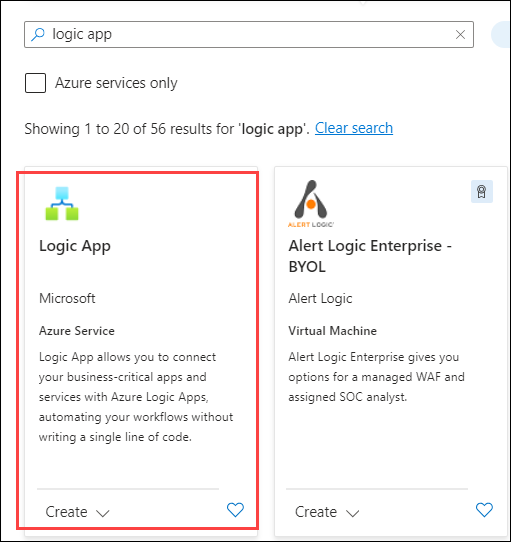

1. On the **Logic App** blade, click **Create**.

    

1. Under the **Create Logic App** select **Consumption** and click on **Select**.

    


1. On the **Basics** tab, under **Create Logic App (Multi-tenant)** provide the following information and click on **Review + create**.

1. Subscription: **Select the default Subscription (1)**.

1. Resource group: **Select the existing  Resource group (2)**.

1. Logic App name: Enter **logic-az220-training-<inject key="DeploymentID" enableCopy="false"/> (3)**

1. Region : **eastus (4)**

1. Enable Log Analytics:  Set to **No (5)**.

    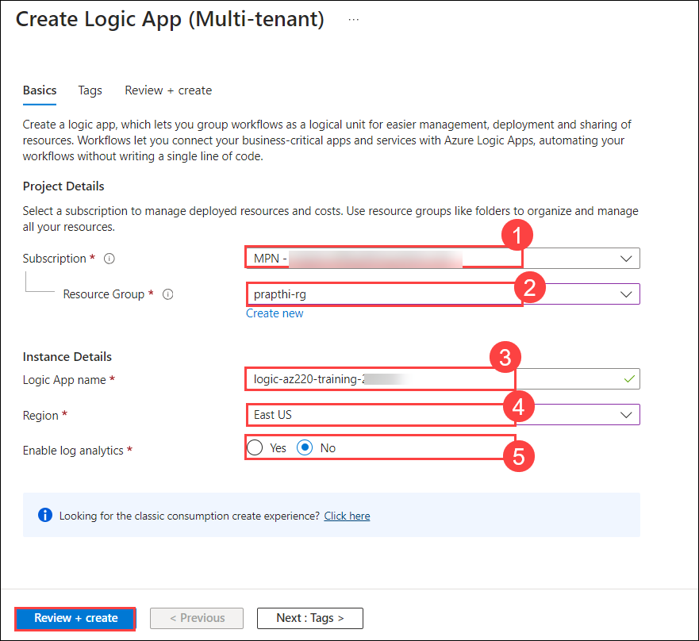

1. Click on **Create**.

    > **Note**:  It will take a minute or two for the Logic App deployment to complete.

1. After the deployment is completed, click on **Go to resource**.

1. Here you can see the newly created Logic app.

    

#### Task 2: Configure Your Logic App

1. Navigate to your Resource group **az220rg**, click on the newly created Logic App resource that was just deployed.

    If the **logic-az220-training-<inject key="DeploymentID" enableCopy="false"/>** Logic app is not displayed, refresh the resource group tile.

1. On the **Logic App** blade, navigate to the **Logic Apps Designer** under Development Tools and click on **Add a Trigger**.

    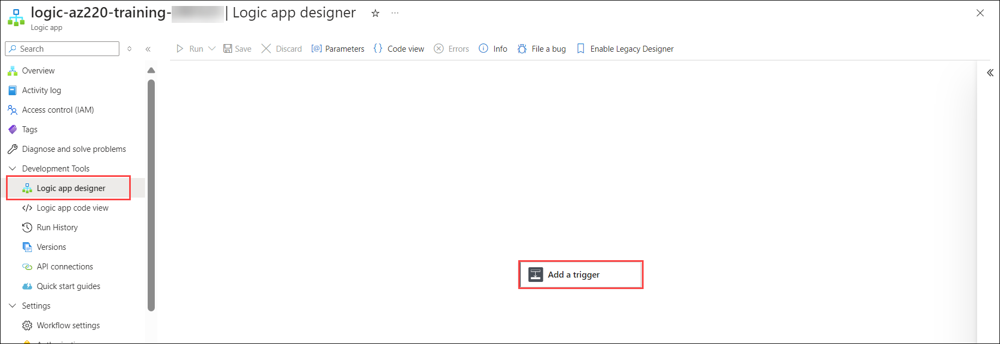

1. On the **Add a trigger** section, Search for **When a HTTP request is received(1)** and select it from the results **(2)**.

    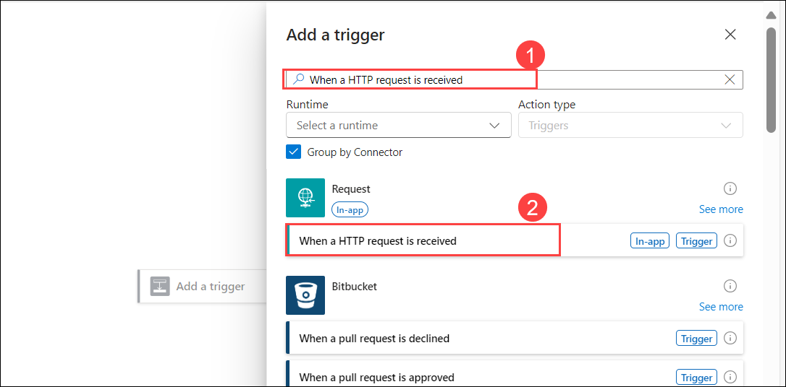

1. Notice that the visual designer opens with the **When a HTTP request is received** trigger selected. Click the trigger to open the details.

1. On the **When a HTTP request is received** trigger, under the **Request Body JSON Schema** textbox, click the **Use sample payload to generate schema** link.

    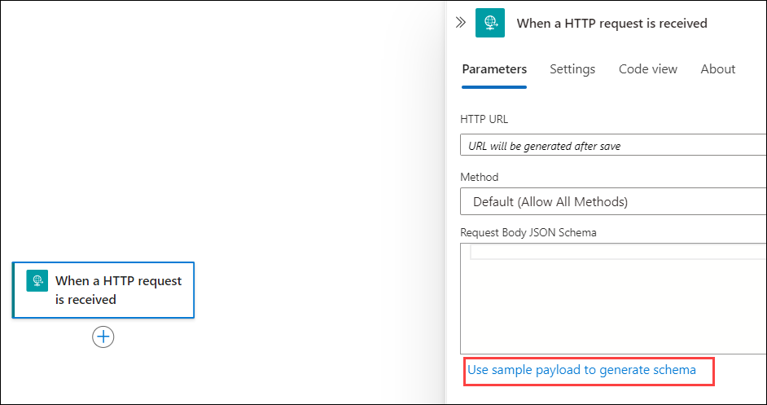
   

    > **Note**: In the next step you will be adding the **DeviceCreated** sample event schema to the Request Body JSON Schema textbox. This sample, along with a couple of other event schema samples and some associated documentation, can be found at the following link for those who want to learn more: [Azure Event Grid event schema for IoT Hub](https://docs.microsoft.com/en-us/azure/event-grid/event-schema-iot-hub).

1. Use a copy-and-paste operation to add the following sample JSON to the **Enter or paste a sample JSON payload.** textbox, and then click **Done**.

    ```json
    [{
      "id": "56afc886-767b-d359-d59e-0da7877166b2",
      "topic": "/SUBSCRIPTIONS/<subscription ID>/RESOURCEGROUPS/<resource group name>/PROVIDERS/MICROSOFT.DEVICES/IOTHUBS/<hub name>",
      "subject": "devices/LogicAppTestDevice",
      "eventType": "Microsoft.Devices.DeviceCreated",
      "eventTime": "2018-01-02T19:17:44.4383997Z",
      "data": {
        "twin": {
          "deviceId": "LogicAppTestDevice",
          "etag": "AAAAAAAAAAE=",
          "deviceEtag": "null",
          "status": "enabled",
          "statusUpdateTime": "0001-01-01T00:00:00",
          "connectionState": "Disconnected",
          "lastActivityTime": "0001-01-01T00:00:00",
          "cloudToDeviceMessageCount": 0,
          "authenticationType": "sas",
          "x509Thumbprint": {
            "primaryThumbprint": null,
            "secondaryThumbprint": null
          },
          "version": 2,
          "properties": {
            "desired": {
              "$metadata": {
                "$lastUpdated": "2018-01-02T19:17:44.4383997Z"
              },
              "$version": 1
            },
            "reported": {
              "$metadata": {
                "$lastUpdated": "2018-01-02T19:17:44.4383997Z"
              },
              "$version": 1
            }
          }
        },
        "hubName": "egtesthub1",
        "deviceId": "LogicAppTestDevice"
      },
      "dataVersion": "1",
      "metadataVersion": "1"
    }]
    ```

    > **NOTE**: The **Enter or paste a sample JSON payload** field is a rich editor that automatically inserts opening and closing braces, etc. In the LODS environment, if the "type text" option is used to copy the JSON above directly into the **Enter or paste a sample JSON payload** field, extra braces will be added and the content will be invalid. Instead, open **Notepad** within the LODS VM first, and then send the text to **Notepad**. From there, you can copy the text into the field without error.


    

1. Notice that the **Request Body JSON Schema** textbox is now populated with a JSON schema that was automatically generated based on the sample JSON that you provided.


    

1. Below the **When a HTTP request is received** trigger, click **+(1)** and select **Add an action(2)**.


    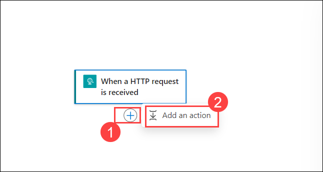

1. Click **Add an operation** and in the search textbox, enter **Outlook.com**

1. In the list of Actions, scroll down to the Send options, and then click **Send an email (V2)**.


    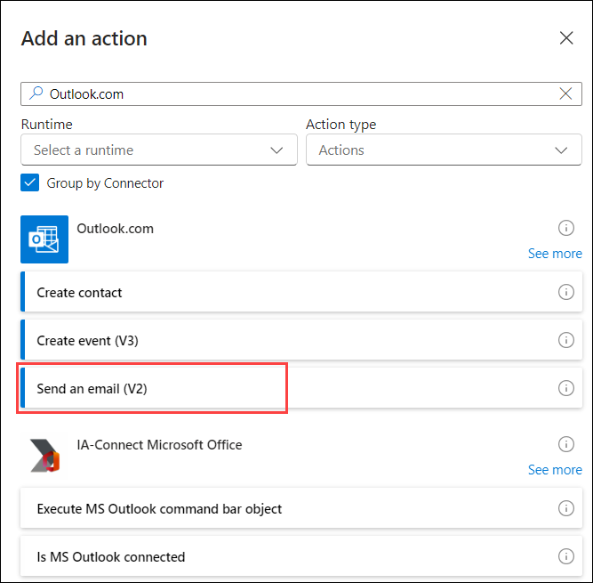

    > **Note**:  These instructions walk through configuring the Logic App to send an email using an **Outlook.com** email address. Alternatively, the Logic App can also be configured to send email using the Office 365 Outlook or Gmail connectors as well.

1. On the **Outlook.com** connector, click **Sign in**, and then follow the prompts to authenticate with an existing Outlook.com account.


    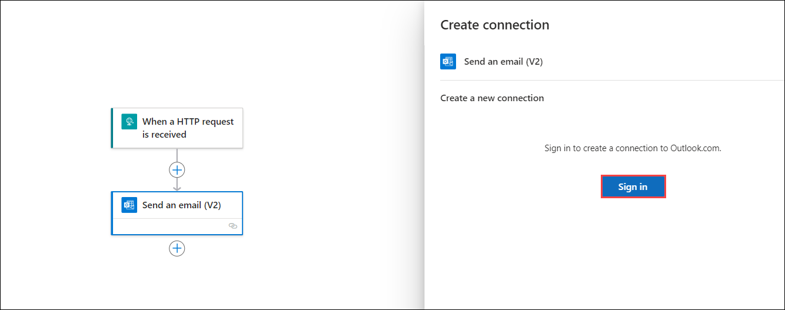

    > **Note**: If **The browser has blocked the popup window** this pop up appears,at top of the page select **Always allow pop-ups and redirects from hhtps://portal.azure.com** and select **Done**.


    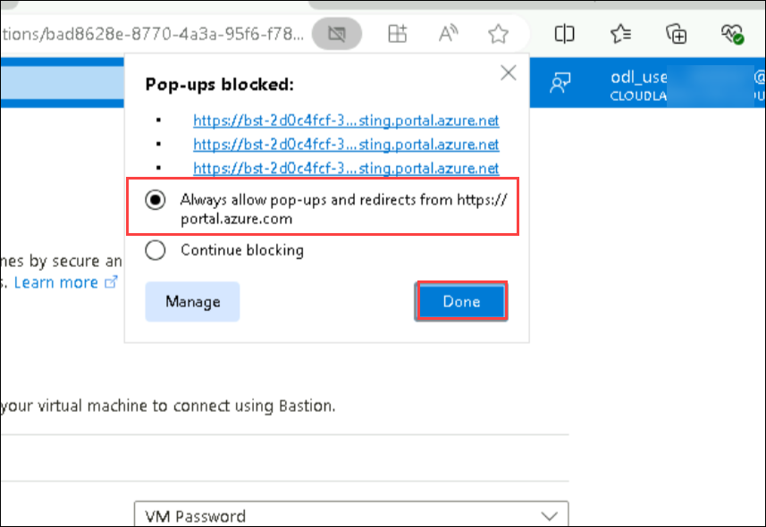

1. When prompted sign in with your credentials.

   - **Email/Username:** <inject key="AzureAdUserEmail"></inject>

        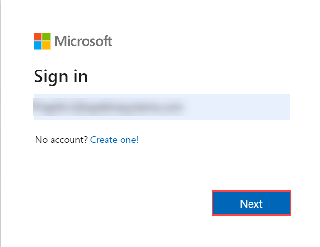

 
   - **Password:** <inject key="AzureAdUserPassword"></inject>

     

If prompted to **stay signed in**, you can click **No**.

1. If prompted to Let this app access your info? (1 of 1 apps) select **Accept**.

1. On the **Send an email (V2)** action, in the **To** field, enter an email address **(1)** to send email messages to.

    For the purposes of this lab, you will provide an email address where you can receive the email notification. You can enter the Outlook.com account used for this connector, or another email account that is easy for you to access.

    The Outlook.com account that was authenticated in the step above will be used to send the emails.


1. In the **Subject** field, enter **IoT Hub alert:(2)**

1. In the **Body** field, enter the following message content **(3)**:

    ```text
    This is an automated email to inform you that:

    {eventType} occurred at {eventTime}

    IoT Hub: {hubName}
    Device ID: {deviceID}
    Connection state: {connectionState}
    ```
    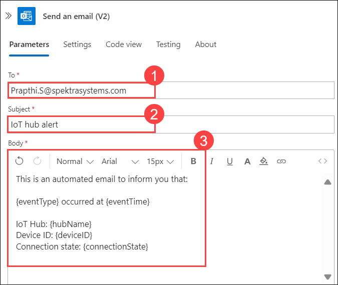

1. Take a moment to examine the message body that you just entered.

    You may have realized that the **curly-braces entries** are intended to represent dynamic content. You will need to replace these placeholder entries with the actual Dynamic content values.

1. To replace the values, click on the field you want replace and select the marked icon shown in the below image.

    

1. Type the value in the search rext box and select it from the drop down.

    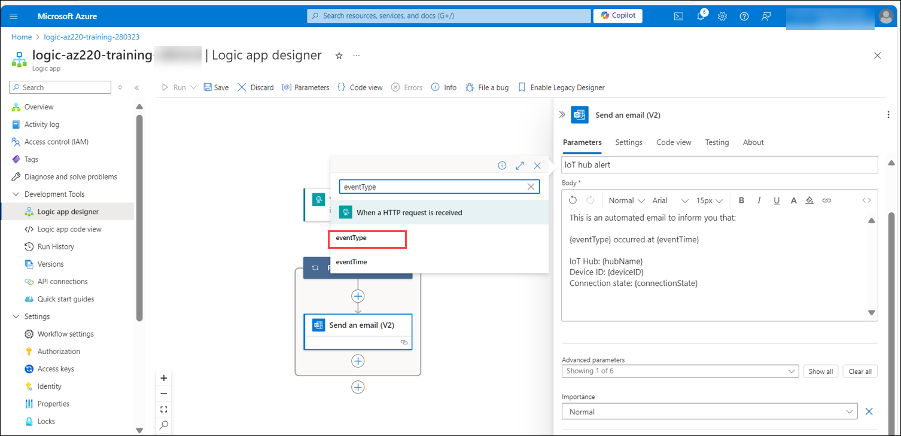

    In the next step you will replace each placeholder value with the corresponding Dynamic content value.

1. For each dynamic content placeholder, delete the entry and then replace it with the corresponding Dynamic content field.

    When you add the first dynamic content value, because the input data schema is for an array, the Logic Apps Designer will automatically change the e-mail action to be nested inside of a **For each** action. When this happens, the **Send an email (V2)** action will collapse. To reopen your email message, click **Send an email (V2)**, and then continue editing the message body.

    When you have completed this step you should see a message body that is similar to the following:

    

1. At the top of the designer, to save all changes to the Logic App Workflow, click **Save** .

1. To expand the _When a HTTP request is received_ trigger, click **When a HTTP request is received(1)**.

1. Copy the value for the **HTTP POST URL(2)** that is displayed.

    The **HTTP POST URL** will look similar to the following:

    ```text
    https://prod-87.eastus.logic.azure.com:443/workflows/b16b5556cbc54c97b063479ed55b2669/triggers/manual/paths/invoke?api-version=2016-10-01&sp=%2Ftriggers%2Fmanual%2Frun&sv=1.0&sig=ZGqYl-R5JKTugLG3GR5Ir1FuM0zIpCrMw4Q2WycJRiM
    ```

    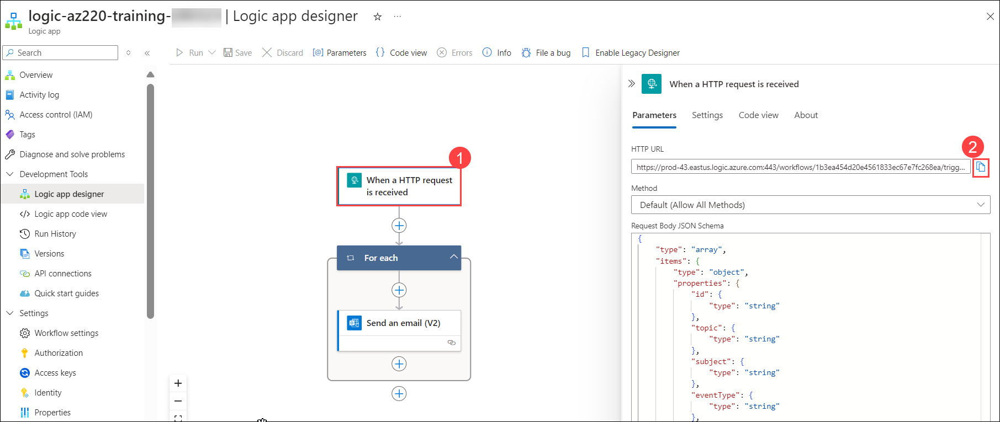

    This URL is the Web Hook endpoint that is used to call the Logic App trigger via HTTPS. Notice the **sig** query string parameter and it's value. The **sig** parameter contains the shared access key that is used to authenticate requests to the Web Hook endpoint.

1. Save the URL for future reference in the notepad or in any other text editor.

### Exercise 2: Configure Azure IoT Hub Event Subscription

Azure IoT Hub integrates with Azure Event Grid so that you can send event notifications to other services and trigger downstream processes. You can configure business applications to listen for IoT Hub events so that you can react to critical events in a reliable, scalable, and secure manner. For example, build an application that updates a database, creates a work ticket, and delivers an email notification every time a new IoT device is registered to your IoT hub.

In this exercise, you will create an Event Subscription within Azure IoT Hub to setup Event Grid integration that will trigger a Logic App to send an alert email.

1. Navigate back to your Azure portal dashboard.

1. On your resource group tile, to navigate to your IoT Hub, click **iot-az220-training-<inject key="DeploymentID" enableCopy="false"/>**.

    

1. On the **IoT Hub** blade, on the left side navigation menu, click **Events**.

1. On the **Events** pane, at the top, click **+ Event Subscription**.

    

1. On the Create Event Subscription blade, in the **Name** field, enter **MyDeviceCreateEvent(1)**

1. Ensure that the **EventSchema** field is set to **Event Grid Schema(2)**.

1. Under the **TOPIC DETAILS** section, in the **System Topic Name** field, enter **device-creation(3)**.

    This section is informational and read-only

1. Under **EVENT TYPES**, open the **Filter to Event Types** dropdown, and then de-select all of the choices except **Device Created(4)**.

1. Under **ENDPOINT DETAILS**, open the **Endpoint Type** dropdown, and then click **Web Hook(5)**.

1. Under **ENDPOINT DETAILS**, click **Configure an endpoint(6)**.

1. In the **Select Web Hook** pane, under **Subscriber Endpoint**, paste the URL **(7)** that you copied from your logic app, then click **Confirm Selection(8)**.

    > **Important**: Do not click Create!

    You could save the event subscription here, and receive notifications for every device that is created in your IoT hub. However, for this lab we will use the optional fields to filter for specific devices.

    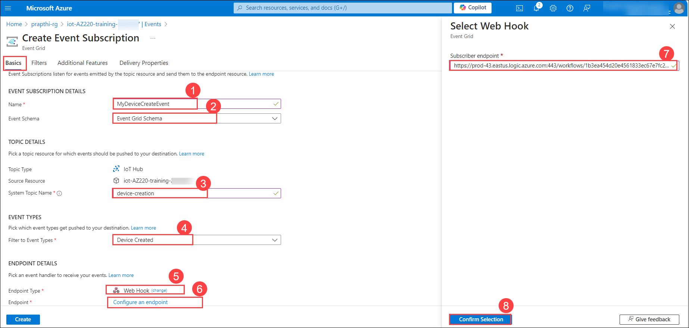

1. At the top of the pane, click **Filters** .

    You will be using filters to filter for specific devices.

1. Under **ADVANCED FILTERS**, click **Add new filter(1)**, and then fill in the fields with these values:

    * **Key**: Enter `Subject` **(2)**

    * **Operator**: Select **String begins with(3)** 

    * **Value**:  Enter `devices/sensor-th` **(4)**

    We will use this value to filter for device events associated with the Cheese Cave temperature and humidity sensors.

1. To save the event subscription, click **Create(5)**.

    

### Exercise 3: Test Your Logic App with New Devices

Test your logic app by creating a new device to trigger an event notification email.

1. In your Azure portal, if needed, navigate to your IoT Hub blade.

1. On the left side navigation menu, under **Device Management**, click **Devices(1)**.

1. At the top of the IoT devices blade, click **+ New(2)**.
    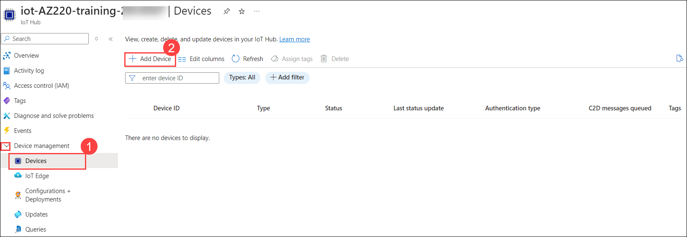

1. In the **Device ID** field, enter **sensor-th-0050**

1. Leave all other fields at the defaults, and then click **Save**.

    

1. To test the event subscription filters, create additional devices using the following device IDs:

    * `sensor-v-3002`
    * `sensor-th-0030`
    * `sensor-v-3003`

    If you added the four examples total, your list of IoT devices should look like the following image:

    

1. Once you've added a few devices to your IoT hub, check your email to see which ones triggered the logic app.

## Summary

In this lab, you have created an Azure Logic App to automatically send emails based on IoT events. You have configured an Azure IoT Hub event subscription to trigger the Logic App and set up new IoT devices to generate events that activate the workflow.


### You have successfully completed the lab

