# Lab 06: Explore and analyze time stamped data with Azure Data Explorer

### Estimated Duration: 120 minutes

## Overview

Your hard work implementing Azure IoT services and tools has paid off. Contoso has rolled out their "Asset Condition Tracking System" that monitors the environmental conditions of cheese containers during shipment.

Two weeks after launching the new system it has revealed a temperature spike in-transit for a specific shipment. Some of the cheese in the shipment was ruined, but the new system did ensure that the affected cheese wasn't delivered to the customer. Since you know the Azure IoT side of the monitoring system better than anyone, you will lead the investigation.

Management has asked you to determine if the system can be improved, hopefully to the point where it will prevent the loss of product in the future. You correlate the IoT devices' sensor data taken from the trucks and planes used during the shipment. It appears that the temperature in one of the trucks rose unexpectedly in a particular area of the vehicle and created the heat spike in one of the transport containers (which was equipped with an IoT device monitoring temperature and humidity).

Your team decides that further improvements to the monitoring system will require near real-time data exploration and root-cause analysis.

You propose adding Azure Data Explorer to the Azure IoT solution. This will enable Contoso to quickly store, visualize, and query the large amounts of time series data that are generated by the IoT devices in the trucks, planes, and containers, and to visualize changes over time.

## Lab Objectives

In this lab, you will complete the following activities:

 - Task 1: Setup Azure Data Explorer
 - Task 2: Run Simulated IoT Devices
 - Task 3: Visualize Data using Azure Data Explorer Queries

## Architecture Diagram


## Task 1: Setup Azure Data Explorer

Azure Data Explorer is an end-to-end platform-as-a-service offering used to collect, process, store, analyze, and query data from IoT solutions at scale. Azure Data Explorer is designed for ad hoc data exploration and operational analysis of data that's highly contextualized and optimized for time series.

In this exercise, you will setup Azure Data Explorer integration with Azure IoT Hub.

1. In the Azure Portal, navigate to your resource group. Under resources select **iot-az220-training-<inject key="DeploymentID" enableCopy="false" />**.

    

2. On the IoT Hub left hand menu, select **Built-in-endpoints**. Create a new consumer group **adxevents**.

   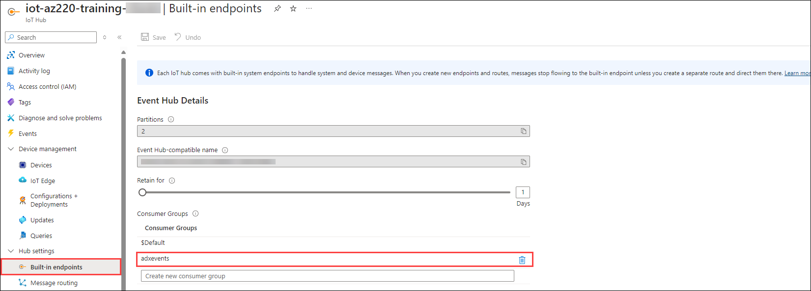

1. On the Azure portal menu, click **+ Create a resource**.

   

1. On the **New** blade, in the **Search the Marketplace** textbox, enter **Azure Data Explorer**. In the search results, click **Azure Data Explorer**. On the **Azure Data Explorer** blade, click **Create**.

   

1. On the **Create an Azure Data Explorer Cluster** blade, Under **Resource group** select **az220rg-<inject key="DeploymentID" enableCopy="false" />**. Provide the cluster name as **adx-az220-<inject key="DeploymentID" enableCopy="false" />** and also select the workload as **Dev/test**. Click on **Next : Scale >**.

   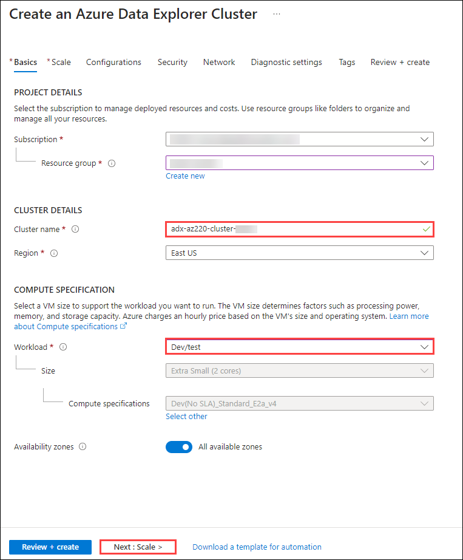

1. In the **Scale** tab, leave settings to default. Click on **Next : Configurations >**.

   

1. On the **Configurations** **(1)** tab, select **on** **(2)** for **Streaming ingestion**. Click on **Review + create** and click on **Create** on next pane.

   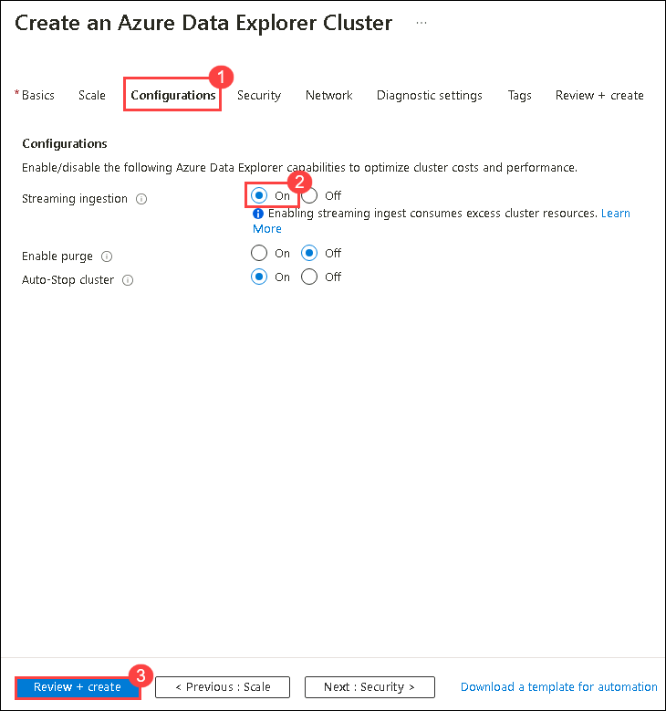

   >**Note**: This may take few minutes to get deployed.

1. On the **Azure Data Explorer** overview page, click on **Create** under Database Creation.

   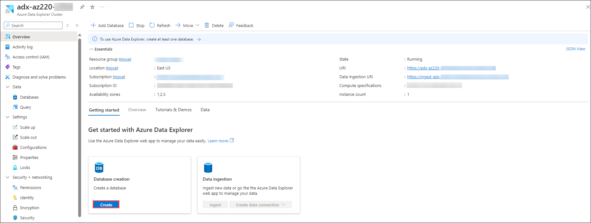

1. On the **Azure Data Explorer Database**, provide the database name as **streamingdata** and click on **Create**. 

   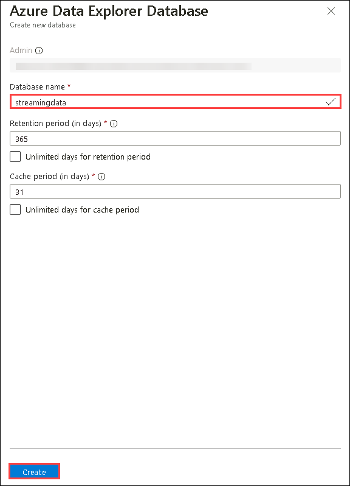

1. Navigate to **Databases** from left hand menu, verify that **streamingdata** database is created.

   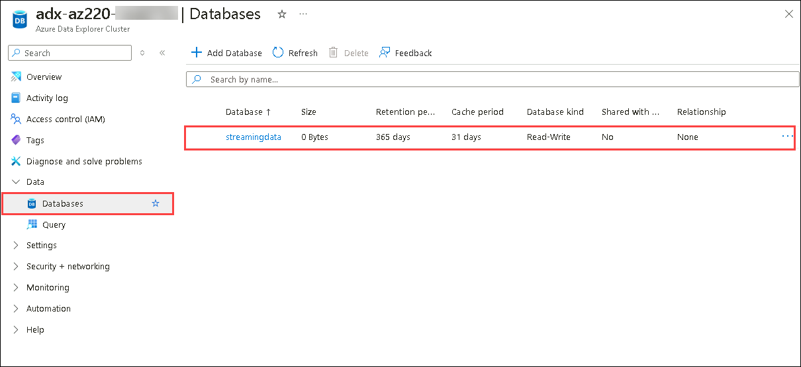

1. Select **Query** from left hand menu.

   

1. On the **Query** pane, run the following KQL script to create a table named **Telemetry**. Click on **Run**.

    ```
    .create table Telemetry (
    messageId: int,
    deviceId: string,
    temperature:decimal,
    humidity:decimal,
    temperatureAlert: string,
    IotHubDeviceId: string,
    IotHubEnqueuedTime: datetime
    )
    ```

   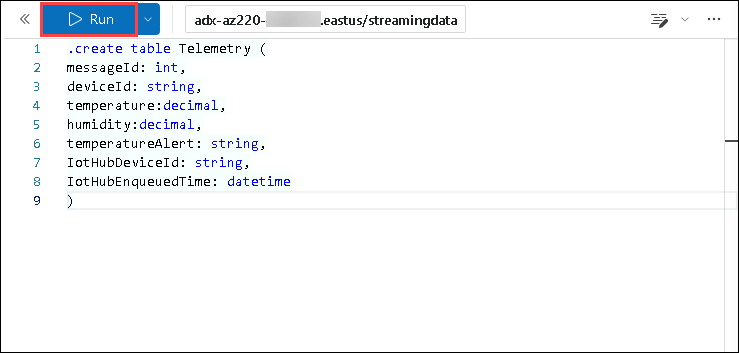

1. After running the script successfully, replace the script with the following to create a JSON Mapping.

   ```
   .alter table Telemetry policy streamingingestion enable

   .create table Telemetry ingestion json mapping "JsonTelemetryMapping"
    '['
        '{"Column": "messageId", "Properties": {"Path": "$.messageId"}},'
        '{"Column": "deviceId", "Properties": {"Path": "$.deviceId"}},'
        '{"Column": "temperature", "Properties": {"Path": "$.temperature"}},'
        '{"Column": "humidity", "Properties": {"Path": "$.humidity"}},'
        '{"Column": "temperatureAlert", "Properties": {"Path": "$.Properties.temperatureAlert"}},'
        '{ "column" : "IotHubDeviceId", "Properties":{"Path":"$.iothub-connection-device-id"}},'
        '{"Column": "IotHubEnqueuedTime", "Properties": {"Path": "$.iothub-enqueuedtime"}}'
    ']'
   ```
    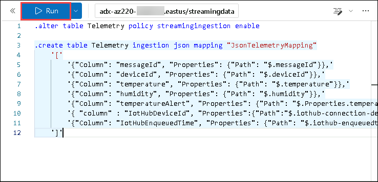

1. After running the script successfully, navigate back to **Databases** pane and click on **Streamingdata** database.

   

1. In the **streamingdata** page, select **Data connection** under settings.

   

1. Select **+ Add data connection**, in the dropdown click on **IoT Hub**.

   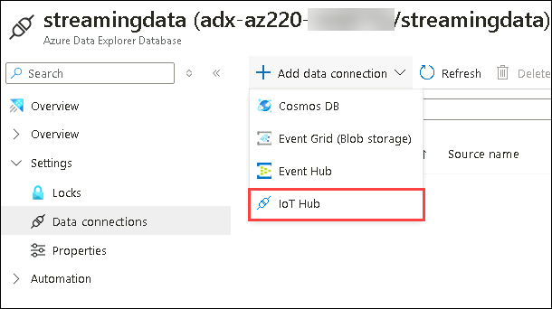

1. In the **create data connection** page, select **Event system properties** dropdown.

   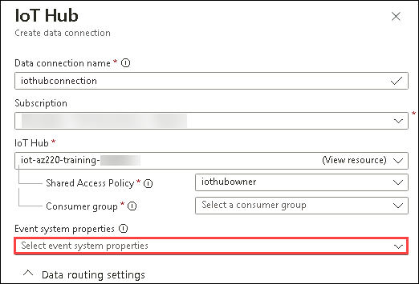

1. In the menu, select **iothub-enqueuedtime** and **iothub-connection-device-id** as shown. Click on **Apply**.

   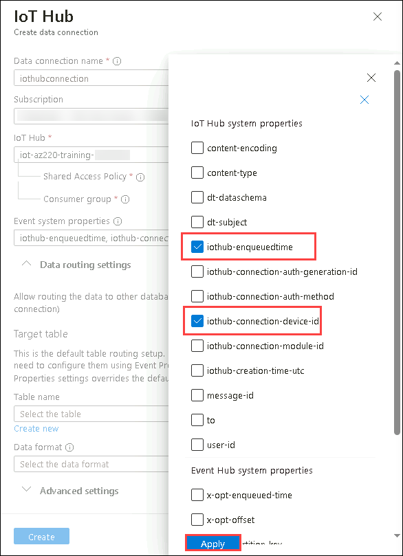

1. In the **create data connection** page, provide the following details then click on **Create** **(9)**:

    | Setting | Value |
    | --- | --- |
    | Data connection name | **iothubconnection** **(1)**  |
    | Subscription | **Default** |
    | IoT Hub | **iot-az220-training-<inject key="DeploymentID" enableCopy="false" />** **(2)** |
    | Shared Access Policy | **iothubowner** **(3)** |
    | Consumer group | **adxevents** **(4)** |
    | Event system properties | Select as shown **(5)** |
    | Table name | **Telemetry** **(6)** |
    | Data format | **JSON** **(7)** |
    | Mapping name | **JsonTelemetryMapping** **(8)** |

     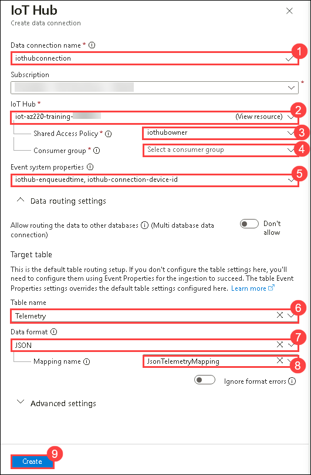

1. Wait till the connection is created. It may take some time, try to refresh the page untill you see the connection.

   

>**Congratulations** on completing the Task! Now, it's time to validate it. Here are the steps:

  > - Hit the Validate button for the corresponding task. If you receive a success message, you have successfully validated the lab. 
  > - If not, carefully read the error message and retry the step, following the instructions in the lab guide.
  > - If you need any assistance, please contact us at labs-support@spektrasystems.com.

<validation step="455aeeef-964f-40a5-90ed-6fc8d87479c7" />

## Task 2: Run Simulated IoT Devices

In this exercise, you will run the simulated devices so that they start sending telemetry events to Azure IoT Hub.

1. In the Azure portal, navigate to your resource group and select **iot-az220-training-<inject key="DeploymentID" enableCopy="false" />**.

    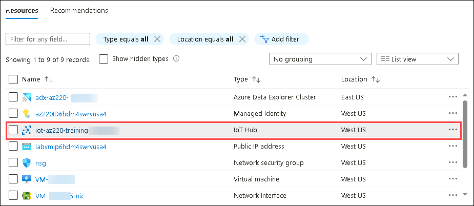

1. In the IoT Hub pane, select **Devices** from the left menu under device management. select the device **sensor-thl-container-0001**.

    

1. On the device page, copy the **Primary connection string** and note it down. You will be using this further in this exercise.

    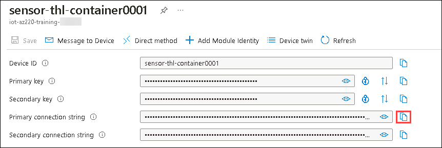

1. Follow the same steps for other two devices.

1. Open **Visual Studio Code** from the desktop.

    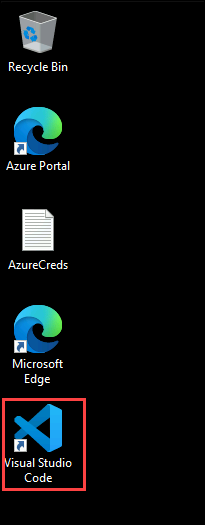

1. On the **File** menu, click **Open Folder**.

    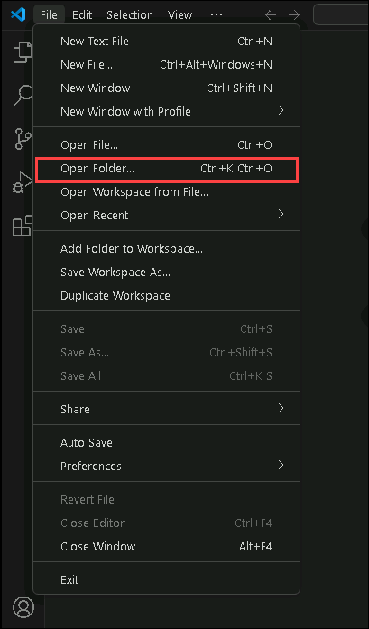

1. In the **Open Folder** dialog, navigate to `C:\LabFiles\az-220\MSLearnLabs-AZ-220-Microsoft-Azure-IoT-Developer-stage-rowancollege\Allfiles\Labs\10-Explore and analyze time stamped data with Time Series Insights\Starter\ContainerSimulation` and click on **select folder**.

1. After selecting the folder, if you are prompted with a security dialog, select **Yes, I trust the authors**.

    
 
1. In the EXPLORER pane, to open the Program.cs file, click **Program.cs**.

    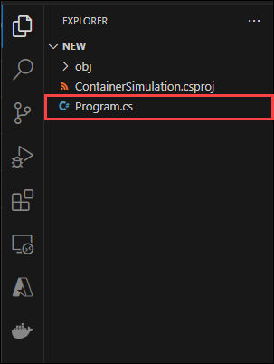

1. Locate the variables used to assign the connections strings.

    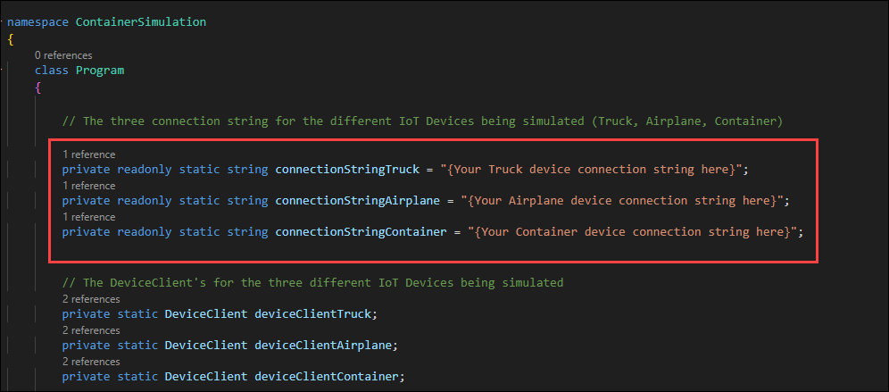

1. Update the variable assignments with the connection strings that you saved earlier in the lab. Be sure to replace the placeholder values with the Connection String for the corresponding IoT device.

1. On the **File** menu, click **Save**.

   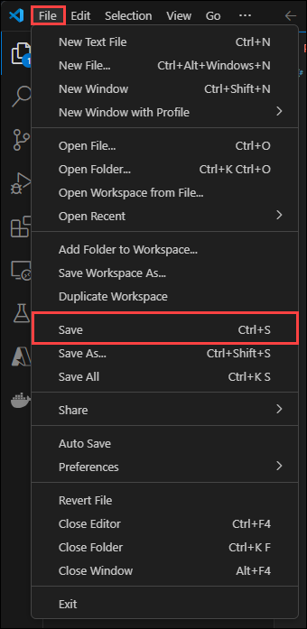

1. Open **New terminal** in **Visual Studio Code**

   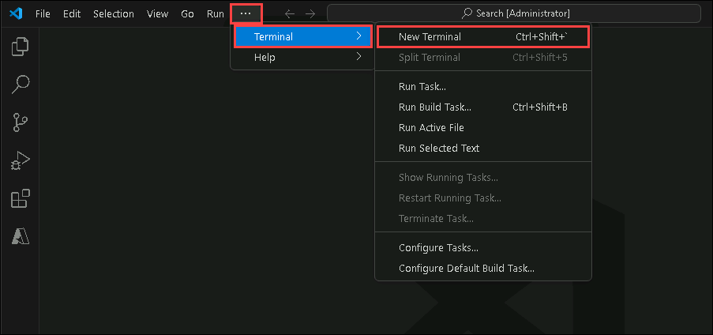

1. Within the **Terminal** pane, ensure that the command prompt specifies the path to the lab 10 **/Starter/ContainerSimulation** directory.

   

1. At the command prompt, to build and run the **ContainerSimulation** app, enter the following command:

    ```cmd/sh
    dotnet run
    ```

1. Notice the messages displayed in the Terminal pane. Once the **ContainerSimulation** app is running, it will begin outputting telemetry data to the terminal. This is the telemetry data that it is sending to Azure IoT Hub. When the **ContainerSimulation** app is running, the **Terminal** output will look similar to the following:

    ```text
    12/27/2019 8:51:30 PM > Sending TRUCK message: {"temperature":35.15660452608195,"humidity":48.422323938240865}
    12/27/2019 8:51:31 PM > Sending AIRPLANE message: {"temperature":17.126545186374237,"humidity":36.46941012936869}
    12/27/2019 8:51:31 PM > Sending CONTAINER message: {"temperature":21.986403302500637,"humidity":47.847680384455096}
    12/27/2019 8:51:32 PM > Sending TRUCK message: {"temperature":36.10474464823629,"humidity":48.82029906486022}
    12/27/2019 8:51:32 PM > Sending AIRPLANE message: {"temperature":16.55005930170971,"humidity":36.49988437459935}
    12/27/2019 8:51:32 PM > Sending CONTAINER message: {"temperature":21.811727088543286,"humidity":50.0}
    ```

1. Leave the **ContainerSimulation** app running for the remainder of this lab. This will ensure device telemetry from the three devices (Container, Truck, and Airplane) is being sent to Azure IoT Hub.

1. After the **ContainerSimulation** app has been running for 30 seconds, you will see a message telling you that the **Container** device is changing transport methods. The transport method will change between **Truck** and **Airplane** every 30 seconds. The **Terminal** output will look like the following when this happens:

    ```text
    12/27/2019 8:51:40 PM > CONTAINER transport changed to: TRUCK
    ```

    > **Note**:  In production the shipping container would only change transport methods during the normal course of shipping. For the simulated scenario in this lab, it's performed every 30 seconds to give a short enough data duration that will fit during the course of performing the steps in this lab.

## Task 3: Visualize Data using Azure Data Explorer Queries

In this exercise, you will get a quick introduction to working with time series data using Azure Data Explorer.

1. In the Azure Portal, navigate to your resource group and select **adx-az220-<inject key="DeploymentID" enableCopy="false" />** Azure Data Explorer Cluster.

    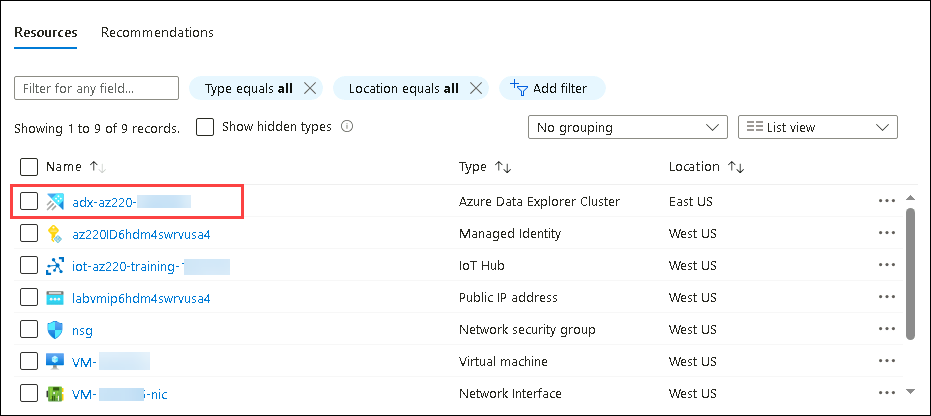

1. In the Azure Data Explorer page select **Databases** from left hand menu. Click on **streamingdata** database.

    

1. In the **streamingdata** page select **Data connection** from left menu, under settings. Select the **Health(symbol)** as shown.

    

1. Check the Graph, observe the **Events recived** and **Events processed** data.

    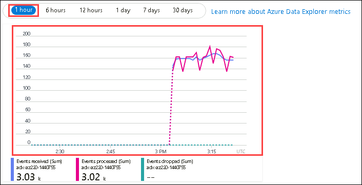

1. Navigate back to Azure Data Explorer pane and select **Query** and run the following query to visualize the data that is streamed.

    ```
    Telemetry
    | summarize count() by bin(temperature, 2 )
    | render columnchart
    ```

    

1. Wait till the query succeeded, check the histogram created to visualize data.

    

    >**Note**: If you are not able to see any result, wait for few minutes and refresh the page, till the results are shown.

## Summary

In this lab, you started by noting the connection strings of pre-deployed IoT devices. You then created an Azure Data Explorer cluster and set up a database to store and query data. After connecting the database to the IoT Hub, you ran a simulator to generate IoT data, which was ingested into Azure Data Explorer. Finally, you visualized the data to analyze and gain insights, showcasing how Azure services can be used to build an effective IoT data pipeline.

## You have successfully completed the lab!!
