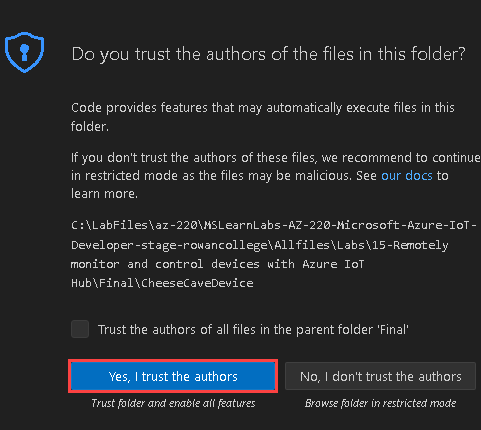
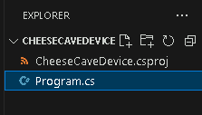
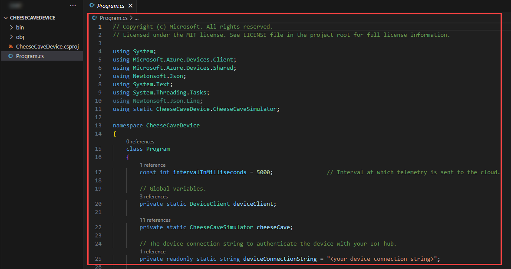
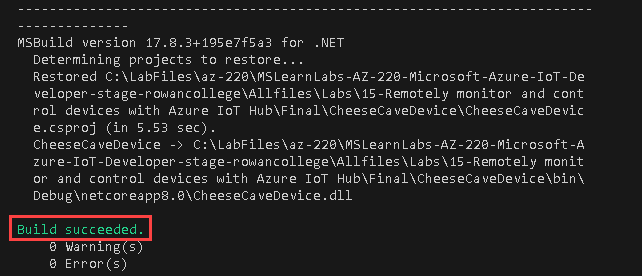
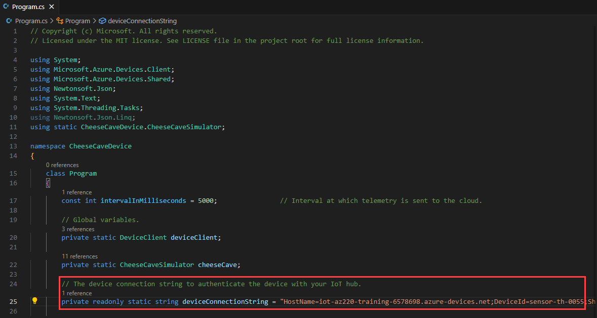
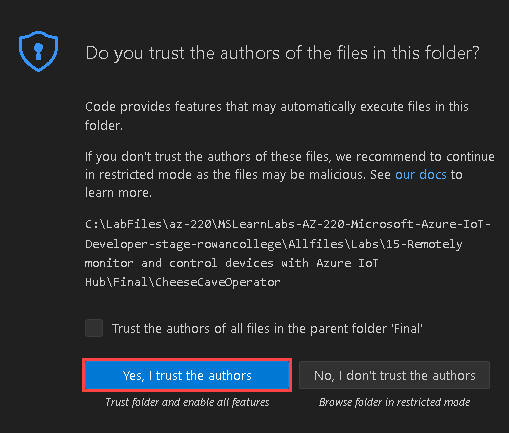
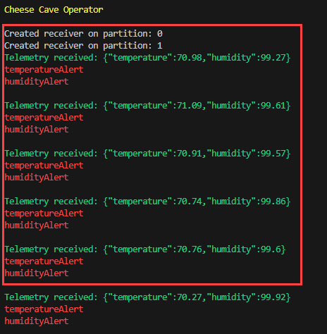
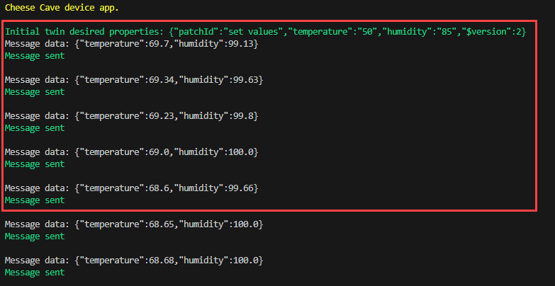
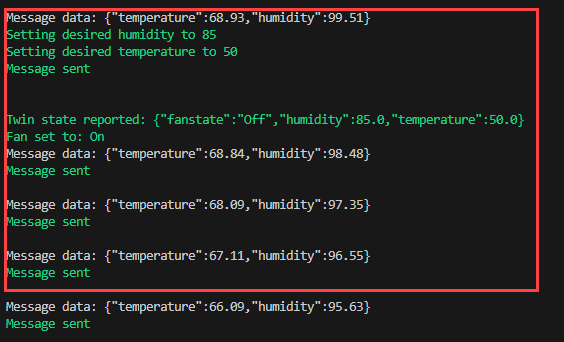

# Lab 10: Remotely monitor and control devices with Azure IoT Hub

### Estimated Duration: 120 minutes

## Lab Overview

In this lab, you will set up and configure a simulated IoT environment using Azure IoT Hub. You will start by preparing your environment and reviewing code for sending and receiving telemetry data. Next, you’ll complete a backend application to receive this telemetry and implement functionality to invoke a direct method for controlling a simulated fan. Finally, you'll enable and test Device Twin functionality to synchronize device properties and settings. This exercise includes working with Visual Studio Code to manage code and configurations, running applications, and verifying functionality through terminal outputs.

## Lab Scenario

Contoso is proud of its award-winning cheeses and is careful to maintain the perfect temperature and humidity during the entire manufacturing process, but conditions during the aging process have always received special attention.

In recent years, Contoso has used environmental sensors to record the conditions within their natural cheese caves where aging occurs, and has used that data to identify a near perfect environment. Data from the most successful (aka award producing) locations indicates that the ideal temperature for aging cheese is approximately 50 degrees Fahrenheit +/- 5 degrees (10 degrees Celsius +/- 2.8 degrees). The ideal humidity value, measured in percentage of maximum saturation, is approximately 85% +/- 10%.

These ideal temperature and humidity values work well for most types of cheese. However, minor variations are required for especially hard or especially soft cheeses. The environment must also be adjusted at critical times/phases within the aging process to achieve specific results, such as a desired condition for the cheese rind.

Contoso is lucky enough to operate cheese caves (in certain geographic regions) that naturally maintain ideal conditions almost year-round. However, even in these locations, managing the environment during the aging process is critical. Also, natural caves often have a number of different chambers, each of which can have a slightly different environment. Cheese varieties are placed in a chamber (zone) that matches their specific requirements. To keep environmental conditions within desired limits, Contoso uses an air processing/conditioning system that controls both temperature and humidity.

Currently, an operator monitors the environmental conditions within each zone of a cave facility and adjusts the air processing system settings when required to maintain the desired temperature and humidity. Operators are able to visit each zone and check the environmental conditions every 4 hours. In locations where temperature changes dramatically between the daytime high and nighttime low, conditions can slip outside of the desired limits.

Contoso has tasked you with implementing an automated system that keeps the cave environment within control limits.

In this lab, you will be prototyping a cheese cave monitoring system that implements IoT devices. Each device is equipped with temperature and humidity sensors, and is connected to the air processing system that controls temperature and humidity for the zone where the device is located.

## Lab Objectives

In this lab, you will complete the following:

- Exercise 1: Configure Lab Prerequisites
- Exercise 2: Review Code to Send and Receive Telemetry
- Exercise 3: Complete a Second App to Receive Telemetry
- Exercise 4: Include Code to Invoke a Direct Method
- Exercise 5: Implement the Device Twin functionality

## Architecture Diagram


### Exercise 1: Configure Lab Prerequisites

1. Navigate to the **Environment (1)** tab in your VM and copy the following values in a notepad for future use:

   - **deviceConnectionString (2)**
   - **eventHubsCompatibleEndpoint (3)**
   - **eventHubsCompatiblePath (4)**
   - **iotHubSasKey (5)**
   - **serviceConnectionString (6)**

        

## Exercise 2: Review Code to Send and Receive Telemetry

In this exercise, you will be completing the simulated device app (for the sensor-th-0055 device) that sends telemetry to your IoT Hub.

### Task 1: Open a simulated device that generates telemetry

1. Open **Visual Studio Code** from the desktop.

      

1. Click on **File (1)** and select **Open Folder (2)**.

     

1. Navigate to `C:\LabFiles\az-220\MSLearnLabs-AZ-220-Microsoft-Azure-IoT-Developer-stage-rowancollege\Allfiles\Labs\15-Remotely monitor and control devices with Azure IoT Hub\Final` and select the **CheeseCaveDevice** folder.

1. Click on **Yes, i trust the authors** when prompted.

      

1. You should see the following files listed in the EXPLORER pane of Visual Studio Code:

     - CheeseCaveDevice.csproj
     - Program.cs

         

1. To open the code file, click **Program.cs**.
   
      

1. In Vs code, click on **Terminal (1)** and click on **New Terminal (2)**. Notice that the directory path is indicated as part of the command prompt.

   

1. At the terminal command prompt, to verify the application builds, enter the following command:

    ```bash
    dotnet build
    ```

      

### Task 2: Configure connection and review code

The simulated device app that you will build in this task simulates an IoT device that monitors temperature and humidity. The app will simulate sensor readings and communicate sensor data every two seconds.

1. In visual studio code, open **Program.cs**. Replace the **assigned placeholder** value (including the angle braces) with the device **connection string** that you saved earlier.
   
      

1. Press `Ctrl + S` to save the file.

### Task 3: Test your Code to Send Telemetry

1. In Vs code, click on **Terminal (1)** and click on **New Terminal (2)**.

      

1. At the Terminal command prompt, to run the simulated device app, enter the following command:

    ```bash
    dotnet run
    ```

    > **Note**: This command will run the **Program.cs** file in the current folder.

1. Notice the output being sent to the Terminal.

      

    > **Note**:  Green text is used to indicate when things are working as they should be. Red text is used to indicate when there is a problem. If you don't get a screen similar to the image above, start by checking your device connection string.

1. Leave this app running.

## Exercise 3: Complete a Second App to Receive Telemetry

Now that you have your (simulated) cheese cave device sending telemetry to your IoT Hub, you need to complete a back-end app that can connect to IoT Hub and "listen" for that telemetry. Eventually, this back-end app will be used to automate the control of the temperature in the cheese cave.

### Task 1: Complete an app to receive telemetry

In this task, you will begin work on the back-end app that will be used to receive telemetry from the IoT Hub Event Hub endpoint.

1. Open an additional instance of Visual Studio Code.

1. On the **File (1)** menu, click **Open Folder (2)**.

    

1. In the **Open Folder** dialog, navigate to the `C:\LabFiles\az-220\MSLearnLabs-AZ-220-Microsoft-Azure-IoT-Developer-stage-rowancollege\Allfiles\Labs\15-Remotely monitor and control devices with Azure IoT Hub\Final`.

    > **NOTE**: Be sure to open the **Final** folder. You do not want the project in the Starter folder.

1. Click **CheeseCaveOperator**, and then click **Select Folder**.

1. Click on **Yes, I trust the authors** when prompted.

      

#### Task 2: Enable the telemetry receiver code

1. In the **EXPLORER** pane, click **Program.cs**.

1. Replace the **eventHubsCompatibleEndpoint (1)**, **eventHubsCompatiblePath (2)** ,**iotHubSasKey (3)** and **serviceConnectionString (4)** placeholder values with the values that you saved earlier in the exercise-1.

     
  
1. Press `Ctrl + S` to save.

### Task 3: Test your Code to Receive Telemetry

This test is important, checking whether your back-end app is picking up the telemetry being sent out by your simulated device. Remember your device app is still running, and sending telemetry.

1. In Vs code, click on **Terminal (1)** and click on **New Terminal (2)**.

      

1. To run the **CheeseCaveOperator** back-end app in the terminal, enter the following command:

    ```bash
    dotnet run
    ```

1. Take a minute to observe the output to the Terminal.

    

    > **Note**:  Green text is used to show things are working as they should and red text when bad stuff is happening. If you don't get a screen similar to this image, start by checking your device connection string.

1. Leave this app running for a moment longer.

1. You can press **CTRL+C** in the Terminal pane to stop the apps.

## Exercise 4: Include Code to Invoke a Direct Method

Direct methods let the backend app control device features or settings by sending commands with parameters. In the Contoso scenario, you'll add code to a device to control a fan in a cheese cave simulation, with the backend app invoking this method through IoT Hub. The device needs to handle errors like fan failures or invalid parameters. You'll update the device app with the direct method code and the backend app to call it. In this Exercise, you will update your device app by adding the code for a direct method that will simulate turning on the fan in the cheese cave. Next, you will add code to the back-end service app to invoke this direct method.

### Task 1: Enable Code to Define a Direct Method in the Device App

1. Return to the Visual Studio Code instance that contains your **CheeseCaveDevice** application.

    > **Note**: If the app is still running, use the Terminal pane to exit the app (click inside the Terminal pane to set the focus and the press **CTRL+C** to exit the running application).

1. Ensure that **Program.cs** is open in the code editor.

1. Locate the **Create a handler for the direct method call** comment line within the code.

1. To register the direct method, uncomment the following code:

    ```csharp
    deviceClient.SetMethodHandlerAsync("SetFanState", SetFanState, null).Wait();
    ```

      

    > **Note**: Notice that the **SetFanState** direct method handler is also set up by this code. As you can see, the **SetMethodHandlerAsync** method of deviceClient takes the remote method name **"SetFanState"** as an argument, along with the actual local method to call, and a user context object (in this case null).

1. Locate the **Handle the direct method call** comment line within the code.

1. Uncomment the **SetFanState** direct method, and review the code and comments.

    `  

### Task 2: Add Code to Call Your Direct Method

1. Return to the Visual Studio Code instance that contains the **CheeseCaveOperator** application.

    > **Note**: If the app is still running, use the Terminal pane to exit the app (click inside the Terminal pane to set the focus and the press **CTRL+C** to exit the running application).

1. Ensure that **Program.cs** is open in the code editor.

1. Near the top of the file, notice that the application defines a global variable to hold a service client instance:

    ```csharp
    private static ServiceClient serviceClient;
    ```

1. Locate the **Create a ServiceClient to communicate with service-facing endpoint on your hub** comment line within the code.

1. Uncomment the following lines of code:

    ```csharp
    serviceClient = ServiceClient.CreateFromConnectionString(serviceConnectionString);
    
    InvokeMethod().GetAwaiter().GetResult();
    ```

      

1. Press `Ctrl + S` to save.

### Task 3: Test the direct method

To test the direct method, you will need to start the apps in the correct order. You can't invoke a direct method that hasn't been registered!

1. Switch to the instance of Visual Studio Code that contains the **CheeseCaveDevice** device app.

1. In Vs code, click on **Terminal (1)** and click on **New Terminal (2)**.
   
   

1. To start the **CheeseCaveDevice** device app, open a Terminal pane and then enter a `dotnet run` command.

    It will begin writing to the terminal, and telemetry messages will be displayed.

    ```bash
    dotnet run
    ```
   
1. Switch to the instance of Visual Studio Code that contains the **CheeseCaveOperator** back-end app.

1. In Vs code, click on **Terminal (1)** and click on **New Terminal (2)**.
   
     

1. To start the **CheeseCaveOperator** back-end app, open a Terminal pane and then enter a `dotnet run` command.

    ```bash
    dotnet run
    ```
    
      > **Note**:  If you see the message **Direct method failed: timed-out** then double check you have saved the changes in the **CheeseCaveDevice** and started the app. The CheeseCaveOperator back-end app will immediately call the direct method.

      

1. Now check the console output for the **CheeseCaveDevice** device app, you should see that the fan has been turned on.

      

## Exercise 5: Implement the Device Twin functionality

A device twin in IoT Hub includes:

- **Tags**: Non-visible metadata about the device.
- **Desired properties**: Settings specified by the backend app.
- **Reported properties**: Current values of device settings.
- **Device identity properties**: Read-only device identifiers.

Device twins synchronize automatically with the IoT device and can be queried by the backend app to retrieve current state information without contacting the device directly. While direct methods can also set device properties, device twins automatically manage and store this data, simplifying access and maintenance. In this exercise, you'll update the backend app to demonstrate device twin synchronization, with device twin functionality already covered in previous labs.

### Task 1: Enable Code To Use Device Twins To Synchronize Device Properties

1. Return to the Visual Studio Code instance that is running the **CheeseCaveOperator** back-end app.

1. If the app is still running, place input focus on the terminal and press **CTRL+C** to exit the app.

1. Ensure that the **Program.cs** is open.

1. Near the top of the file, notice that a global variable for a **RegistryManager** instance is already defined:

    ```csharp
    private static RegistryManager registryManager;
    ```

1. In the **Main** method, locate the **A registry manager is used to access the digital twins** comment line within the code.

1. To enable the functionality that creates the registry manager instance and sets the twin properties, uncomment the following code lines:

    ```csharp
    registryManager = RegistryManager.CreateFromConnectionString(serviceConnectionString);
    SetTwinProperties().Wait();
    ```

      

    > **Note**: Notice that the **serviceConnectionString** value is used to connect to the IoT Hub with the appropriate access level. The **SetTwinProperties** is then called.

1. Press `Ctrl+S` to save.

### Task 2: Enable Code to Synchronize Device Twin Settings for the Device

1. Return to the Visual Studio Code instance that contains the **CheeseCaveDevice** app.

1. If the app is still running, place input focus on the terminal and press **CTRL+C** to exit the app.

1. Ensure that the **Program.cs** file is open in the Code Editor pane.

1. In the **Main** method, locate the **Get the device twin to report the initial desired properties** comment line within the code.

1. To register the desired property changed handler, uncomment the following code lines:

    ```csharp
    Twin deviceTwin = deviceClient.GetTwinAsync().GetAwaiter().GetResult();

    ConsoleHelper.WriteGreenMessage("Initial twin desired properties: " + deviceTwin.Properties.Desired.ToJson());

    deviceClient.SetDesiredPropertyUpdateCallbackAsync(OnDesiredPropertyChanged, null).Wait();
    ```

      

1. Locate the **OnDesiredPropertyChanged is the handler that is invoked when a desired property changes in the device twin** comment line within the code.

1. Take a minute to review the OnDesiredPropertyChanged code.

1. Press `Ctrl+S` to save.

    > **Note**:  Now you have added support for device twins to your app, you can reconsider having explicit variables such as **desiredHumidity**. You could use the variables in the device twin object instead.

### Task 3: Test the Device Twins

To test the code that manages device twin desired property changes, you will start the apps in the correct order, device application first and then back-end application.

1. Switch to the instance of Visual Studio Code that contains the **CheeseCaveDevice** device app.

1. To start the **CheeseCaveDevice** device app, open a Terminal pane and then enter a `dotnet run` command.

    It will begin writing to the terminal, and telemetry messages will be displayed.

    ```bash
    dotnet run
    ```

1. Switch to the instance of Visual Studio Code that contains the **CheeseCaveOperator** back-end app.

1. To start the **CheeseCaveOperator** back-end app, open a Terminal pane and then enter a `dotnet run` command.

    ```bash
    dotnet run
    ```

1. Switch back to the instance of Visual Studio Code that contains the **CheeseCaveDevice** device app.

1. Check the console output and confirm that the device twin synchronized correctly.

    

    

    If you let the fan do its work, you should eventually see red alerts turn off (unless the fan fails)

    

## Summary
In this lab, you have configured the Lab Prerequisites, reviewed Code to Send and Receive Telemetry, completed a Second App to Receive Telemetry, included Code to Invoke a Direct Method and implemented the Device Twin functionality.

### You have successfully completed the lab
