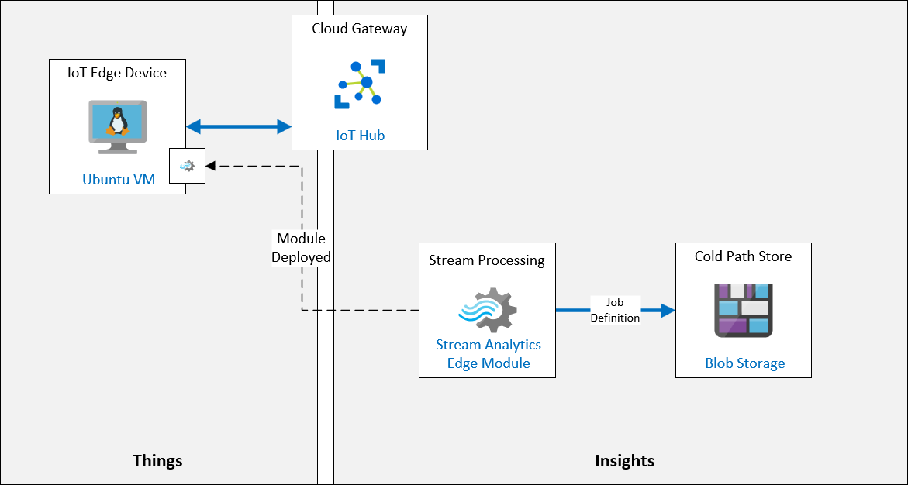

# Lab 11: Introduction to Azure IoT Edge

# Introduction to Azure IoT Edge

## Lab Scenario

To encourage local consumers in a global marketplace, Contoso has partnered with local artisans to produce cheese in new regions around the globe.

Each location supports multiple production lines that are equipped with the mixing and processing machines that are used to create the local cheeses. Currently, the facilities have IoT devices connected to each machine. These devices stream sensor data to Azure and all data is processed in the cloud.

Due to the large amount of data being collected and the urgent time response needed on some of the machines, Contoso wants to use an IoT Edge gateway device to bring some of the intelligence to the edge for immediate processing. A portion of the data will still be sent to the cloud. Bringing data intelligence to the IoT Edge also ensures that they will be able to process data and react quickly even if the local network is poor.

You have been tasked with prototyping the Azure IoT Edge solution. To begin, you will be setting up an IoT Edge device that monitors temperature (simulating a device connected to one of the cheese processing machines). You will then deploy a Stream Analytics module to the device that will be used to calculate the average temperature and generate an alert notification if process control values are exceeded.

The following resources will be created:

## Lab Objectives

In this lab, you will complete the following:

- Exercise 1: Configure Lab Prerequisites
- Exercise 2: Create and configure an IoT Edge VM
- Exercise 3: Add Edge Module to Edge Device
- Exercise 4: Deploy Azure Stream Analytics as IoT Edge Module

### Exercise 1: Configure Lab Prerequisites

1. Search for Resource Groups and select .

1. Select Deployments under the Settings tab in the left pane.
   
