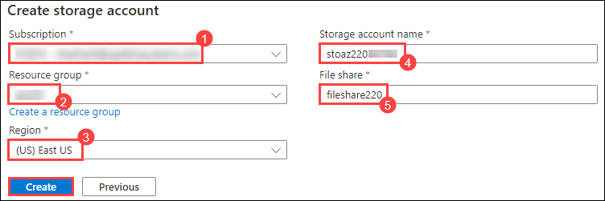

# Lab 11: Introduction to Azure IoT Edge

# Introduction to Azure IoT Edge

## Lab Scenario

To encourage local consumers in a global marketplace, Contoso has partnered with local artisans to produce cheese in new regions around the globe.

Each location supports multiple production lines that are equipped with the mixing and processing machines that are used to create the local cheeses. Currently, the facilities have IoT devices connected to each machine. These devices stream sensor data to Azure and all data is processed in the cloud.

Due to the large amount of data being collected and the urgent time response needed on some of the machines, Contoso wants to use an IoT Edge gateway device to bring some of the intelligence to the edge for immediate processing. A portion of the data will still be sent to the cloud. Bringing data intelligence to the IoT Edge also ensures that they will be able to process data and react quickly even if the local network is poor.

You have been tasked with prototyping the Azure IoT Edge solution. To begin, you will be setting up an IoT Edge device that monitors temperature (simulating a device connected to one of the cheese processing machines). You will then deploy a Stream Analytics module to the device that will be used to calculate the average temperature and generate an alert notification if process control values are exceeded.

The following resources will be created:


## Lab Objectives

In this lab, you will complete the following:

- Exercise 1: Configure Lab Prerequisites
- Exercise 2: Create and configure an IoT Edge VM
- Exercise 3: Add Edge Module to Edge Device
- Exercise 4: Deploy Azure Stream Analytics as IoT Edge Module


### Exercise 1: Configure Lab Prerequisites

1. Search for Resource Groups and select .

1. Select **Deployments** under the **Settings** tab in the left pane.

      

1. Select the existing deployment, click on **Outputs** and copy the **Connection string**.

      

1. Search for **Iot Hub** and select it.
   
1. Select **iot-az220-training-<inject key="DeploymentID" enableCopy="false"></inject>**, click on **Iot Edge** under **Device Management** tab in the left pane.

1. Click on **+ Add IoT Edge Device**.

1. Provide the name as **sensor-th-0067 (1)** and click on **Save (2)**.

      

1. Navigate to **iot-az220-training-<inject key="DeploymentID" enableCopy="false"></inject>**, click on **Devices (1)** and select **sensor-th-0067 (2)**. 

      

1. Copy the **Primary connection string** in a notepad for future use.

      
   
### Exercise 2: Create and configure an IoT Edge VM

### Task 1: Create an IoT Edge Device Identity in IoT Hub using Azure CLI

1. On the Azure portal toolbar, to open the **Azure Cloud Shell**, click **Cloud Shell**.

   The Cloud Shell button is to the right of the search field and has an icon that appears to represent a command prompt.

   A Cloud Shell window will open near the bottom of the display screen.

      

1. Click on **Bash** when prompted.

      

1. Select the checkbox for **Mount Storage account (1)**, select the existing **subscription (2)** and click on **Apply (3)**.

      

1. Select **I want to create a storage account (1)** and click on **Next (2)**.

      

1. In the create a storage account page:

   - Subscription: **Select the default subscription (1)**
   - Resource Group: **Select the existing resource group (2)**
   - Region: Select **EAST US (3)**
   - Storage Account Name: **Provide the name as stoaz220<inject key="DeploymentID" enableCopy="false"></inject>** **(4)**
   - File Share: **Provide the name as fileshare220 (5)**

        


1. At the command prompt, use the following command to install Azure CLI extension for IoT

    ``` bash
    az extension add --name azure-iot
    ```
   
1. At the command prompt, verify that the Azure CLI extension for IoT is installed and up-to-date, enter the following command:

    ``` bash
    az extension update --name azure-iot
    ```

1. 
