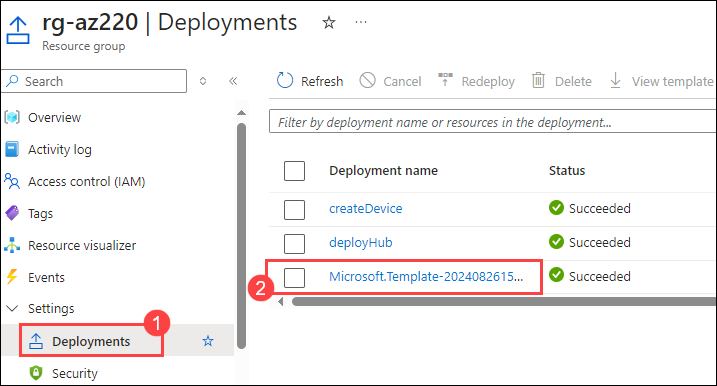
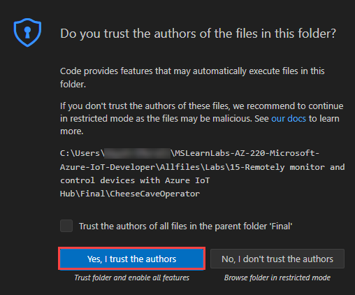

# Lab 15: Remotely monitor and control devices with Azure IoT Hub

## Remotely monitor and control devices with Azure IoT Hub

## Lab Scenario

Contoso is proud of its award-winning cheeses and is careful to maintain the perfect temperature and humidity during the entire manufacturing process, but conditions during the aging process have always received special attention.

In recent years, Contoso has used environmental sensors to record the conditions within their natural cheese caves where aging occurs, and has used that data to identify a near perfect environment. Data from the most successful (aka award producing) locations indicates that the ideal temperature for aging cheese is approximately 50 degrees Fahrenheit +/- 5 degrees (10 degrees Celsius +/- 2.8 degrees). The ideal humidity value, measured in percentage of maximum saturation, is approximately 85% +/- 10%.

These ideal temperature and humidity values work well for most types of cheese. However, minor variations are required for especially hard or especially soft cheeses. The environment must also be adjusted at critical times/phases within the aging process to achieve specific results, such as a desired condition for the cheese rind.

Contoso is lucky enough to operate cheese caves (in certain geographic regions) that naturally maintain ideal conditions almost year-round. However, even in these locations, managing the environment during the aging process is critical. Also, natural caves often have a number of different chambers, each of which can have a slightly different environment. Cheese varieties are placed in a chamber (zone) that matches their specific requirements. To keep environmental conditions within desired limits, Contoso uses an air processing/conditioning system that controls both temperature and humidity.

Currently, an operator monitors the environmental conditions within each zone of a cave facility and adjusts the air processing system settings when required to maintain the desired temperature and humidity. Operators are able to visit each zone and check the environmental conditions every 4 hours. In locations where temperature changes dramatically between the daytime high and nighttime low, conditions can slip outside of the desired limits.

Contoso has tasked you with implementing an automated system that keeps the cave environment within control limits.

In this lab, you will be prototyping a cheese cave monitoring system that implements IoT devices. Each device is equipped with temperature and humidity sensors, and is connected to the air processing system that controls temperature and humidity for the zone where the device is located.

### Simplified Lab Conditions

The frequency of telemetry output is an important consideration in production solutions. A temperature sensor in a refrigeration unit may only need to report once a minute, whereas an acceleration sensor on an aircraft may have to report ten times per second. In some cases, the frequency at which telemetry must be sent is dependent on current conditions. For example, if the temperature in our cheese cave scenario tends to drop quickly at night, you may benefit from having more frequent sensor readings beginning two hours before sunset. Of course the requirement to change the frequency of telemetry does not need to be part of a predictable pattern, the events that drive our need to change IoT device settings can be unpredictable.

To keep things simple in this lab, we will make the following assumptions:

* The device will send telemetry (temperature and humidity values) to the IoT Hub every few seconds. Although this frequency is unrealistic for a cheese cave, it is great for a lab environment when we need to see changes frequently, not every 15 minutes.
* The air processing system is a fan that can be in one of three states: On, Off, or Failed.
  * The fan is initialized to the Off state.
  * Electrical power to the fan is controlled (On/Off) using a direct method on the IoT device.
  * Device Twin desired property values are used to set the desired state of the fan. The desired property values will override any default settings for the fan/device.
  * Temperature can be controlled by turning the fan On/Off (turning the fan On will lower the temperature)

Coding in this lab is broken down into three parts: sending and receiving telemetry, invoking and running a direct method, setting and reading device twin properties.

You will start by writing two apps: one for a device to send telemetry, and one for a back-end service (that will run in the cloud) to receive the telemetry.

The following resources will be created:


## Lab Objectives

In this lab, you will complete the following:

- Exercise 1: Configure Lab Prerequisites
- Exercise 2: Review Code to Send and Receive Telemetry
- Exercise 3: Complete a Second App to Receive Telemetry
- Exercise 4: Include Code to Invoke a Direct Method
- Exercise 5: Implement the Device Twin functionality

## Lab Instructions

### Exercise 1: Configure Lab Prerequisites

1. Search for Resource Groups and select .

1. Select **Deployments** under the Settings tab in the left pane and select the **existing deployment (2)**.

      

1. Click on the **Outputs (1)** from the left pane and copy the following values:

   - **deviceConnectionString (2)**
   - **eventHubsCompatibleEndpoint (3)**
   - **eventHubsCompatiblePath (4)**
   - **iotHubSasKey (5)**
   - **serviceConnectionString (6)**

        

### Exercise 2: Review Code to Send and Receive Telemetry

In this exercise, you will be completing the simulated device app (for the sensor-th-0055 device) that sends telemetry to your IoT Hub.

#### Task 1: Open a simulated device that generates telemetry

1. Open **Visual Studio Code** from the desktop.

      

1. Click on **File (1)** and select **Open Folder (2)**.

1. Navigate to `C:\Users\demouser\MSLearnLabs-AZ-220-Microsoft-Azure-IoT-Developer\Allfiles\Labs\15-Remotely monitor and control devices with Azure IoT Hub\Final` and select the **CheeseCaveDevice** folder.

1. Click on **Yes, i trust the authors** when prompted.

      

1. You should see the following files listed in the EXPLORER pane of Visual Studio Code:

     - CheeseCaveDevice.csproj
     - Program.cs

         

1. To open the code file, click **Program.cs**.

   Take a minute to review the code. The simulated device code uses Symmetric Key authentication, sends both telemetry and logging         messages to the IoT hub, and simulates the implementation of sensors to generate telemetry values.

      

1. In Vs code, click on **Terminal (1)** and click on **New Terminal (2)**. Notice that the directory path is indicated as part of the command prompt.

   

1. At the terminal command prompt, to verify the application builds, enter the following command:

    ```bash
    dotnet build
    ```

      

#### Task 2: Configure connection and review code

The simulated device app that you will build in this task simulates an IoT device that monitors temperature and humidity. The app will simulate sensor readings and communicate sensor data every two seconds.

1. In visual studio code, open **Program.cs**. Replace the assigned placeholder value (including the angle braces) with the device connection string that you saved earlier. This is the only change that you need to implement before sending telemetry to the IoT Hub.

      

1. Press `Ctrl + S` to save.

1. Take a moment to review the structure of the application.

    Notice that the application structure is similar to that used in previous labs:

    - Using statements
    - Namespace definition
      - Program class - responsible for connecting to Azure IoT and sending telemetry
      - CheeseCaveSimulator class - (replaces EnvironmentSensor) rather than just generating telemetry, this class also simulates a running cheese cave environment that is impacted by the operation of a cooling fan.
      - ConsoleHelper - a class that encapsulates writing different colored text to the console

1. Review the **Main** method.

   The **Main** method is used to establish a connection to your IoT hub. You may have noticed that it will be used to integrate the device twin property changes, and in this case, you will also be integrating a direct method.

1. Take a brief look at the **SendDeviceToCloudMessagesAsync** method.

    Notice that it is very similar to previous versions you have created in earlier labs.

1. Take a look at the **CheeseCaveSimulator** class.

   This is an evolution of the **EnvironmentSensor** class used in earlier labs. The primary difference is the introduction of a fan -  if the fan is **On**, the temperature and humidity will gradually move towards the desired values, whereas is the fan is **Off** (or **Failed**), then the temperature and humidity values will move towards the ambient values. Of interest is the fact that there is a 1% chance that fan will be set to the **Failed** state when the temperature is read.

#### Task 3: Test your Code to Send Telemetry

1. In Vs code, click on **Terminal (1)** and click on **New Terminal (2)**.

      

1. At the Terminal command prompt, to run the simulated device app, enter the following command:

    ```bash
    dotnet run
    ```

   This command will run the **Program.cs** file in the current folder.

1. Notice the output being sent to the Terminal.

    You should quickly see console output, similar to the following:

      

    > **Note**:  Green text is used to indicate when things are working as they should be. Red text is used to indicate when there is a problem. If you don't get a screen similar to the image above, start by checking your device connection string.

1. Leave this app running.

    You need to be sending telemetry to IoT Hub later in this lab.

### Exercise 3: Complete a Second App to Receive Telemetry

Now that you have your (simulated) cheese cave device sending telemetry to your IoT Hub, you need to complete a back-end app that can connect to IoT Hub and "listen" for that telemetry. Eventually, this back-end app will be used to automate the control of the temperature in the cheese cave.

#### Task 1: Complete an app to receive telemetry

In this task, you will begin work on the back-end app that will be used to receive telemetry from the IoT Hub Event Hub endpoint.

1. Open an additional instance of Visual Studio Code.

    Since your simulated device app is running in the Visual Studio Code window that you already have open, you need a new instance of Visual Studio Code for the back-end app.

1. On the **File (1)** menu, click **Open Folder (2)**.

1. In the **Open Folder** dialog, navigate to the **Final** folder for lab 15.

    > **NOTE**: Be sure to open the **Final** folder. You do not want the project in the Starter folder.

1. Click **CheeseCaveOperator**, and then click **Select Folder**.

    The CheeseCaveOperator application that has been prepared for you is a simple console application that includes a couple of NuGet package libraries and some comments that will be used guide you through the process of building your code. You will need to add code blocks to the project before you are able to run the application.

1. Click on **Yes, i trust the authors** when prompted.

      

1. 
